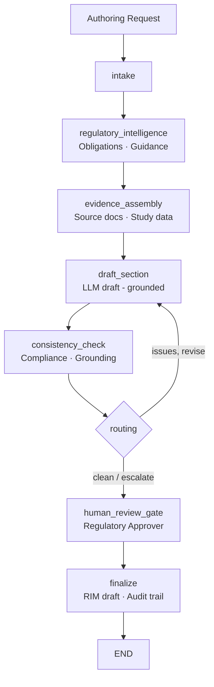

# Regulatory Writing & Intelligence Agent
## AI-assisted regulatory authoring for Life Sciences

> **A LangGraph-orchestrated agent that monitors regulatory obligations, assembles source evidence, and drafts health-authority submission content (benefit-risk summaries, CSR sections, responses to questions) — with grounding verification, automated compliance checks, and a mandatory Regulatory Approver sign-off before anything is finalized.**

---

## The Problem

Regulatory affairs teams at pharma and biotech companies face relentless volume and consistency demands:

- A single marketing application can run to **tens of thousands of pages** across the CTD modules, and content must stay consistent across clinical, safety, quality, and labeling documents.
- Medical writers spend large fractions of their time **searching guidance, assembling source evidence, and reconciling figures** rather than reasoning.
- Health authorities expect **traceable, non-promotional, on-label** content; a hallucinated number or an unsupported claim in a submission is a data-integrity defect, not a typo.
- Regulatory intelligence — tracking FDA/EMA/PMDA updates and mapping them to affected products — is **continuous, manual, and easy to fall behind on**.

Regulatory writing is one of the highest-value, lowest-risk places to deploy agents in 2026: the work is monitoring, comparison, evidence assembly, and drafting — with humans owning every decision.

---

## What the Agent Does

A bounded workflow that mirrors how a regulatory medical writer actually works:

1. **Intake** — parse the authoring request (document type, product, target authority, section, instructions).
2. **Regulatory intelligence** — retrieve open obligations and in-scope guidance (RIM).
3. **Evidence assembly** — gather the source documents and structured study facts that form the *grounding corpus*.
4. **Draft section** — the LLM drafts the section using ONLY the assembled evidence (Anthropic or in-account Bedrock).
5. **Consistency & compliance check** — deterministic gates: grounding verification (every number/entity traceable to state) + no promotional/off-label/absolute-claim language + required structural elements present.
6. **Routing** — clean → human review; issues → one bounded revision; prohibited language → escalate.
7. **Human review gate** — a Regulatory Approver reviews the draft, grounding report, and findings, and approves. **Framework-enforced** via `interrupt_before`.
8. **Finalize** — only with a verified human approval does the gateway create the RIM submission draft (high-risk write) and lock the audit trail.

**The AI assembles and drafts. A qualified human authorizes every submission.**

---

## Regulatory Compliance

| Regulation / standard | Requirement | Agent implementation |
|---|---|---|
| **21 CFR Part 11** | Audit trail, e-signature linkage | Append-only audit entries per node; reviewer identity bound at approval |
| **ICH M4 (CTD)** | Submission structure | Section templates + structural element checks in `consistency_checker` |
| **FDA/EMA good-AI principles (Jan 2026)** | Defined context of use; human accountability | Bounded workflow; HITL gate; AI never submits |
| **Promotional / off-label rules** | No unapproved claims | Prohibited-language gate blocks promotional/absolute claims |
| **GxP data integrity (ALCOA+)** | Attributable, accurate, traceable | Grounding verification; prompt registry; lineage in audit trail |
| **SR 11-7-style model risk** | Versioned, validated model | Prompts hash-pinned in the governance registry; eval harness in CI |

See [docs/regulatory-compliance.md](docs/regulatory-compliance.md).

---

## Architecture



Every system-of-record call (RIM, DMS) flows through the **MCP authorization gateway** (reference logic for **Amazon Bedrock AgentCore Gateway + Identity**): deny-by-default authorization, least-privilege intersection (agent grant ∩ user entitlement), human approval for writes, short-lived scoped tokens, and PHI-masked audit. See [`../platform_core/hcls_agent_platform/mcp_gateway`](../platform_core/hcls_agent_platform/mcp_gateway/README.md).

---

## Systems Integration Map

| Category | Function | Common vendors |
|---|---|---|
| Regulatory information management | Obligations, submissions | Veeva Vault RIM |
| Document / content management | CSR, modules, labeling | Veeva Vault, OpenText |
| Guidance / intelligence | FDA/EMA/PMDA updates | authority portals, licensed feeds |
| LLM | Drafting | Anthropic Claude, AWS Bedrock (in-account) |

See [docs/integration-guide.md](docs/integration-guide.md).

---

## Quick Start (local, no API key)

```bash
cd 01-regulatory-writing-agent
python -m venv venv && source venv/bin/activate     # Windows: venv\Scripts\activate
pip install -r requirements.txt
pip install -e ../platform_core
export EXTRACT_MODE=demo            # deterministic drafts, no API key
streamlit run app.py               # http://localhost:8501
```

Run the tests:

```bash
EXTRACT_MODE=demo pytest tests/ -q
```

Deploy to AWS: see [docs/aws-deployment-guide.md](docs/aws-deployment-guide.md), the CloudFormation quick-deploy in [`../infra/cloudformation`](../infra/cloudformation), and the AWS-native reference in [`../aws-native-reference/01-regulatory-writing`](../aws-native-reference/01-regulatory-writing).

---

## ROI (illustrative)

| Metric | Before | After | Improvement |
|---|---|---|---|
| Hours to first draft of a benefit-risk summary | ~24 | ~6 | **75%** |
| Cross-document consistency findings caught pre-review | manual | automated | **grounding + checks** |
| Regulatory intelligence lag | days | continuous | **near-real-time** |

See [docs/roi-analysis.md](docs/roi-analysis.md).

---

## Project Structure

```
01-regulatory-writing-agent/
├── app.py                       # Streamlit dashboard
├── agent/                       # graph, state, nodes, prompts, persistence
├── tools/                       # gateway_tools, regulatory_intelligence, submission_drafter, consistency_checker
├── data/fixtures/               # sample authoring requests (offline)
├── docs/                        # aws-deployment, integration, regulatory-compliance, roi-analysis
├── tests/                       # tool + graph tests (demo mode)
├── Dockerfile · docker-compose.yml · railway.toml · requirements.txt · .env.example
```

---

## Compliance Disclaimer

This is a decision-support tool for qualified regulatory professionals. AI-generated content requires review and approval by a Regulatory Approver before any health-authority submission. The AI never files submissions autonomously. Validate per your GxP/computer-system-assurance and model-risk procedures before production use.
