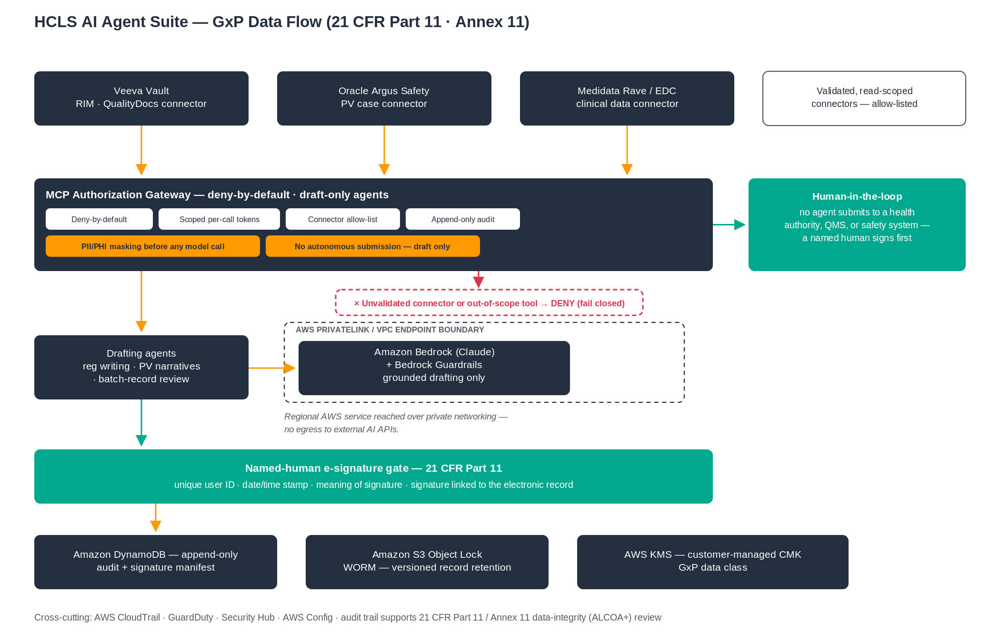
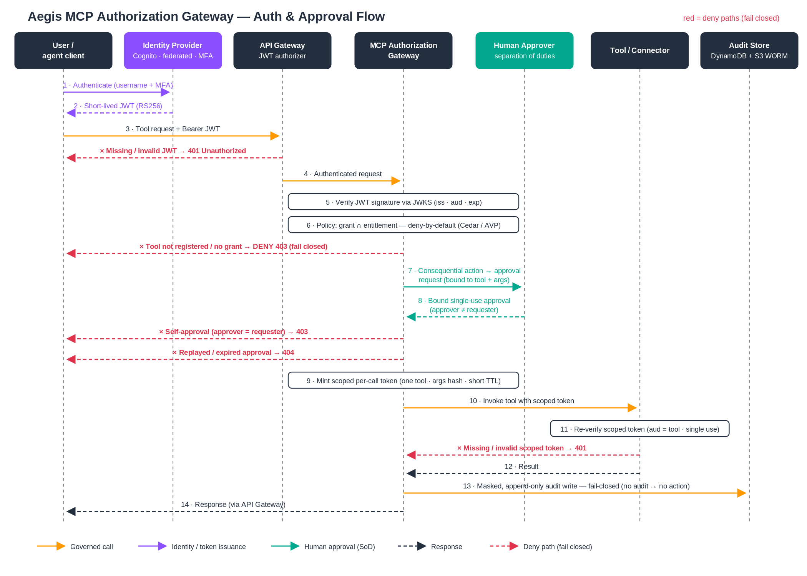

# Assurance Packet — HCLS Agent 02 (Pharmacovigilance ICSR Intake)

*One document, everything a director of architecture, a CISO, a QA/GxP reviewer, or an auditor
needs to evaluate this hero agent — without spelunking the repo. Every claim links to code,
a test, or deployment evidence. Boundaries are in [`NOT-CLAIMS.md`](../NOT-CLAIMS.md); the
machine-readable status is [`MATURITY.yaml`](../MATURITY.yaml).*

> **What this is:** a governed reference accelerator agent, **not** an AWS service, not a
> compliance certification, not a computer-system-validated (CSV) product. Reference accelerator
> for discovery, architecture workshops, and scoped pilots.

---

## 1. At a glance

| | |
|---|---|
| **Agent** | 02 — Pharmacovigilance ICSR Intake (parse AE source → extract E2B(R3) → code MedDRA/WHODrug → assess seriousness + reporting clock → draft CIOMS narrative → **human PV medical review** → submit) |
| **Maturity** | **Deploy-validated** (clean-account golden path run end-to-end + torn down); production-readiness = engagement |
| **Governance pattern** | Conforms to **Aegis Governance Pattern (AGP) v1.0** |
| **System of record** | openFDA / FAERS — **tier-3 live reference connector** (public, read-only). Argus/Veeva Safety = **tier-4, not done** (engagement, under BAA) |
| **Data class** | Public de-identified FAERS in the reference path (**no BAA**). PHI variant = AWS HealthLake FHIR under BAA |
| **Scored quality** | `make eval-agent02` — PHI-leak rate **= 0** (hard gate), seriousness recall 1.0, entity F1 1.0 |
| **Negative controls** | `make neg-demo` — **10/10 refusals enforced** (CI-gated) |

## 2. Architecture & diagrams

- **Suite architecture:** [`docs/SUITE-ARCHITECTURE.md`](../docs/SUITE-ARCHITECTURE.md) · per-agent deploy topology: [`docs/aws-deployment-guide.md`](docs/aws-deployment-guide.md).
- **Data flow (GxP):**  — `docs/diagrams/hcls-gxp-data-flow.svg`.
- **MCP / tool authorization flow:**  — `docs/diagrams/mcp-gateway-auth-flow.svg`.
- **Trust boundaries (summary):**

```
  ┌──────────────── Customer AWS account (per-agent VPC) ─────────────────┐
  │  IdP/Cognito ─(verified JWT)→ [MCP AUTHORIZATION GATEWAY] ──┐         │
  │     deny-by-default · least-privilege intersection ·        │         │
  │     scoped short-lived token · fail-closed PHI mask ·       ▼         │
  │     append-only+WORM audit · token budget          [connector layer] │
  │                                                     │  (fixture /     │
  │  Bedrock + Guardrails ◄─ PrivateLink (regional AWS) │   openFDA r/o)  │
  └───────────────────────────────────┬─────────────────┴────────────────┘
        no egress to external AI APIs  │  human PV reviewer approves the irreversible submit
                                       ▼
                             openFDA/FAERS (public, read-only)   [tier-4 Argus/Veeva = NOT here]
```

Full trust-boundary + abuse-case analysis: [`docs/THREAT-MODEL.md`](../docs/THREAT-MODEL.md).

## 3. MCP / tool authorization — how every call is governed

Deny-by-default gateway: verified identity → **least-privilege intersection** (`permitted ⇔ tool ∈
agent_grant ∩ user_entitlement`) → human approval for consequential/irreversible tools → short-lived
scoped token → fail-closed PHI mask → append-only audit. Reference logic:
[`platform_core/hcls_agent_platform/mcp_gateway/`](../platform_core/hcls_agent_platform/mcp_gateway/)
(policy, tokens, approvals, gateway, audit). **See it run end-to-end:** `make auth-demo`
([`demo/DEMO-AUTH-TRANSCRIPT.md`](demo/../../demo/DEMO-AUTH-TRANSCRIPT.md),
[`demo/demo-auth-walkthrough.html`](../demo/demo-auth-walkthrough.html)).

## 4. Control matrix (condensed)

| Control | Mechanism (code) | Evidence / test | Owner |
|---|---|---|---|
| Identity / authN | Verified IdP JWT (RS256/JWKS); no client-supplied roles in prod (`auth.py`) | `test_auth_walkthrough.py`, negative demo #1–2 | Repo (federated IdP login = Customer) |
| Deny-by-default authz | Least-privilege intersection (`mcp_gateway/policy.py`) | `test_auth_walkthrough.py`, negative demo #3–4 | Repo |
| Consequential commit withheld | `policy.CONSEQUENTIAL_COMMITS` absent from every agent grant | `test_mcp_gateway.py` (withholding test) | Repo |
| Human approval (SoD) | Bound, single-use, args-bound tokens (`mcp_gateway/approvals.py`); `STRICT_APPROVAL=1` in prod | negative demo #5–7 | Repo |
| Scoped short-lived tokens | Per-call, tool-scoped, ephemeral (`mcp_gateway/tokens.py`) | auth walkthrough (confused-deputy/expiry/tamper) | Repo |
| Fail-closed PHI masking | Mask before any model/audit write (`phi.py`, `audit.py`) | negative demo #8 | Repo (unit-tested; runtime verify = Customer) |
| Append-only + WORM audit | DynamoDB append-only + S3 Object Lock (`infra/cloudformation/data.yaml`) | negative demo #9; clean-account run | Repo (WORM retention config = Customer) |
| Token budget / cost control | Hard-cap preflight before spend (`budget.py`) | `test_budget.py`, negative demo #10 | Repo |
| Grounding verification | Every regulated figure traces to source or fails (`governance/grounding.py`) | scored eval (grounding metric) | Repo |
| Private-connectivity inference | Bedrock via PrivateLink; no egress to external AI APIs | `network.yaml`; THREAT-MODEL T4 | Repo/Customer |

Full control-by-control mapping: [`docs/NIST-800-53-CONTROL-MATRIX.md`](../docs/NIST-800-53-CONTROL-MATRIX.md) ·
OWASP-LLM / MITRE ATLAS: [`docs/OWASP-LLM-ATLAS-MAPPING.md`](../docs/OWASP-LLM-ATLAS-MAPPING.md).

## 5. Deployment evidence

All 9 golden paths (incl. this agent) were deployed to a **clean AWS account (us-east-1)**, ran the
full governed workflow (human gate → bound SoD approval → Finalize) to **`SUCCEEDED`**, and were torn
down. Sanitized proof: [`evidence/CLEAN-ACCOUNT-ACCEPTANCE.md`](../evidence/CLEAN-ACCOUNT-ACCEPTANCE.md) ·
notes: [`docs/GOLDEN-PATH-DEPLOY-NOTES.md`](../docs/GOLDEN-PATH-DEPLOY-NOTES.md). openFDA egress is
locked behind an AWS Network Firewall FQDN allow-list (`api.fda.gov` only):
[`infra/golden-path-02-pharmacovigilance/EGRESS-OPENFDA.md`](../infra/golden-path-02-pharmacovigilance/EGRESS-OPENFDA.md).

## 6. Negative-test results (what the platform refuses)

`make neg-demo` → [`../demo/negative_demo.py`](../demo/negative_demo.py), CI-gated by
[`governance/tests/test_negative_demo.py`](../governance/tests/test_negative_demo.py). Latest: **10/10 enforced**.

| # | Attempt | Result |
|---|---|---|
| 1 | No / missing JWT | **DENY** — no authenticated subject |
| 2 | Bad / unverifiable JWT | **DENY** — verification fails closed |
| 3 | Wrong role (human not entitled) | **DENY** — agent may not exceed the human |
| 4 | Unregistered tool | **DENY** — unknown tool |
| 5 | Self-approval | **DENY** — separation of duties (mint) |
| 6 | Approval replay | **DENY** — single-use token consumed |
| 7 | Tampered args after approval | **DENY** — args-hash mismatch |
| 8 | Masker unavailable | **FAIL-CLOSED** — no unmasked record persisted |
| 9 | Audit sink unavailable | **FAIL-CLOSED** — no silent success |
| 10 | Over-budget call | **DENY** — hard cap, before spend |

## 7. Scored quality eval

`make eval-agent02` runs a labeled safety benchmark on every push. Latest: all thresholds pass,
including **PHI-leak rate = 0** (hard gate), seriousness recall 1.0 (≥0.95), entity F1 1.0 (≥0.85),
duplicate accuracy 1.0, grounding 1.0, E2B completeness 1.0. Report:
[`governance/evals/eval-report.md`](../governance/evals/eval-report.md). Negative-control tests prove
the gate catches bad data.

## 8. Known limitations (read before a pilot)

- **Reference connector is public/read-only.** openFDA/FAERS proves the pattern against a *real* system
  but is **not** the customer's production safety database; the tier-4 Argus/Veeva integration is
  engagement work under a BAA.
- **PHI masking is unit-tested, not runtime-verified on AWS.** Runtime verification is a pilot task.
- **Bedrock model invocation is not asserted in the clean-account smoke** (the smoke exercises the
  governed workflow + audit, with a deterministic fallback; the real-Bedrock path is exercised locally).
- **Not CSV/CSA-validated, not HITRUST/SOC 2 certified.** 21 CFR Part 11 controls are *supported by
  design*; the customer owns validation, IdP integration, and quality-system approval.
- **Federated IdP login not proven end-to-end** (authenticated-authorizer-only identity is deployed).

## 9. Shared-responsibility RACI (condensed)

| Area | Repo (accelerator) | Customer (engagement) |
|---|---|---|
| Governed control plane (authz, approval, tokens, audit, masking, budget) | **Owns** (code + tests) | Configures, operates, validates |
| Identity provider + entitlement source of truth | Enables | **Owns** |
| Production connectors (Argus/Veeva, HealthLake FHIR PHI) | Reference only | **Owns** (under BAA) |
| CSV/CSA validation, pen test, SOC 2 / HITRUST, monitoring, DR | — | **Owns** |
| KMS keys, WORM retention schedule, secret material | Reference config | **Owns** |

Full 24-row matrix: [`docs/PRODUCTION-READINESS-AND-SHARED-RESPONSIBILITY.md`](../docs/PRODUCTION-READINESS-AND-SHARED-RESPONSIBILITY.md).

---

*If any statement here reads as stronger than [`NOT-CLAIMS.md`](../NOT-CLAIMS.md) or
[`MATURITY.yaml`](../MATURITY.yaml), those files govern. Report issues via the repo's Security tab.*
