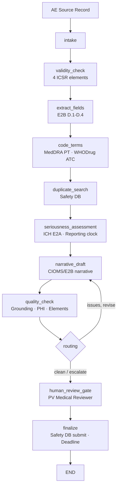

# Pharmacovigilance ICSR Intake Agent
## AI-assisted Individual Case Safety Report processing for Life Sciences

> **A LangGraph-orchestrated agent that parses adverse-event source records (emails, call-center transcripts, literature), extracts ICH E2B(R3) fields, codes to MedDRA and WHODrug, assesses seriousness and reporting clocks, and drafts a CIOMS/E2B-style ICSR narrative — with grounding verification, PHI safeguards, and a mandatory PV Medical Reviewer sign-off before any case is submitted.**

---

## The Problem

Pharmacovigilance teams at MAHs and CROs face relentless volume and tight regulatory deadlines:

- A mid-size MAH can receive **thousands of ICSRs per year** from spontaneous reports, literature, and clinical studies — each requiring structured intake, MedDRA/WHODrug coding, seriousness assessment, and a CIOMS narrative within **7 or 15 calendar days**.
- PV processors spend the majority of case time on **manual transcription and coding**, not on safety assessment.
- A missed 15-day expedited reporting deadline or a fabricated number in an ICSR narrative is not a documentation error — it is a **regulatory data-integrity defect** with potential marketing-authorization consequences.
- MedDRA and WHODrug coding is specialist work; inconsistent coding undermines signal detection and aggregate reporting.

PV case intake is one of the highest-value, lowest-risk places to deploy agents in 2026: the work is parsing, extracting, coding, and drafting — with a qualified PV Medical Reviewer owning every clinical and submission decision.

---

## What the Agent Does

A bounded workflow that mirrors how a PV processor and medical reviewer actually work:

1. **Intake** — register the AE source record (email, call-center, literature) and source type.
2. **Validity check** — determine if the record satisfies the 4 mandatory ICSR elements (identifiable patient, reporter, suspect product, adverse event).
3. **Extract fields** — parse patient demographics, reporter details, drug/dose/route, event description, onset, outcome, dechallenge into E2B(R3)-mapped fields.
4. **Code terms** — MedDRA PT + SOC coding for the adverse event; WHODrug preferred name + ATC for the drug (via gateway: meddra.code_term / whodrug.code_drug).
5. **Duplicate search** — query the safety database for potential duplicate ICSRs (safety.search_duplicates).
6. **Seriousness assessment** — classify all 6 ICH E2A seriousness criteria (death, life-threatening, hospitalization, disability, congenital, other medically important), determine expectedness, and compute the expedited reporting clock (7-day or 15-day).
7. **Narrative draft** — the LLM drafts a CIOMS/E2B-style ICSR narrative from extracted, coded evidence (Anthropic or in-account Bedrock; demo fallback). The narrative covers: who (patient/reporter), what product (drug/dose/mg), what event, when (days/onset), seriousness, and causality.
8. **Quality check** — grounding verification (every number/entity traceable to case state) + PHI check (no raw SSN) + required-element check (all 8 narrative elements present).
9. **Human review gate** — a PV Medical Reviewer confirms causality, seriousness, and reviews the narrative. **Framework-enforced** via `interrupt_before`.
10. **Finalize** — only with a verified human approval does the gateway submit the ICSR to the safety database (high-risk, irreversible write) and lock the audit trail with the reporting deadline.

**The AI parses, codes, assesses, and drafts. A qualified PV Medical Reviewer authorizes every submission.**

---

## Regulatory Compliance

| Regulation / standard | Requirement | Agent implementation |
|---|---|---|
| **GVP Module VI** | Mandatory ICSR elements, reporting timelines | `validity_check` enforces 4 elements; seriousness assessor computes 7-/15-day clock |
| **ICH E2B(R3)** | Structured case data elements | Extracted fields map 1:1 to E2B(R3) blocks D.1–D.8 |
| **ICH E2A** | Seriousness criteria and expedited reporting | All 6 criteria classified deterministically in `seriousness_assessor` |
| **21 CFR Part 11** | Audit trail, e-signature linkage | Append-only audit entries per node; reviewer identity bound at approval |
| **FDA/EMA good-AI principles (Jan 2026)** | Defined context of use; human accountability | Bounded workflow; HITL gate; AI never submits |
| **MedDRA** | Coded adverse event terminology | `coder` + gateway meddra.code_term; demo fixture for offline use |
| **WHODrug** | Coded drug terminology | `coder` + gateway whodrug.code_drug; demo fixture for offline use |
| **GxP data integrity (ALCOA+)** | Attributable, accurate, traceable | Grounding verification; prompt registry; lineage in audit trail |

See [docs/regulatory-compliance.md](docs/regulatory-compliance.md).

---

## Architecture



Every system-of-record call (safety DB, MedDRA, WHODrug) flows through the **MCP
authorization gateway** (reference logic for **Amazon Bedrock AgentCore Gateway +
Identity**): deny-by-default authorization, least-privilege intersection (agent grant
∩ user entitlement), human approval for writes, short-lived scoped tokens, and
PHI-masked audit. See [`../platform_core/hcls_agent_platform/mcp_gateway`](../platform_core/hcls_agent_platform/mcp_gateway/README.md).

---

## Systems Integration Map

| Category | Function | Common vendors |
|---|---|---|
| Safety database | ICSR storage, duplicate search, submission | Argus Safety (Oracle), Veeva Safety, Oracle Empirica Signal |
| MedDRA | Adverse event coding (PT + SOC) | MSSO MedDRA Browser API |
| WHODrug | Drug coding (preferred name + ATC) | Uppsala Monitoring Centre (UMC) WHODrug Global |
| EDC / clinical | Subject data for clinical-trial ICSRs | Medidata Rave, Veeva Vault EDC |
| LLM | Narrative drafting | Anthropic Claude, AWS Bedrock (in-account) |

See [docs/integration-guide.md](docs/integration-guide.md).

---

## Quick Start (local, no API key)

```bash
cd 02-pharmacovigilance-agent
python -m venv venv && source venv/bin/activate     # Windows: venv\Scripts\activate
pip install -r requirements.txt
pip install -e ../platform_core
export EXTRACT_MODE=demo            # deterministic narratives, no API key
streamlit run app.py               # http://localhost:8501
```

Run the tests:

```bash
EXTRACT_MODE=demo pytest tests/ -q
```

Three sample AE cases are included: a non-serious recovered event, a serious hospitalization, and a fatal event with a 7-day expedited clock.

## Live path (Bedrock + real connector)

This agent has a customer-ready live path: real Amazon Bedrock inference and a real HTTP safety-system connector, exercised end-to-end against a bundled local reference service. Swap one URL to point at the customer's Argus / Veeva Safety gateway.

```bash
# end-to-end against the live connector (local reference service);
# auto-selects Bedrock -> Anthropic -> deterministic demo
PYTHONPATH=.:../platform_core python demo/demo_live.py

# point at real systems
export LLM_PROVIDER=bedrock BEDROCK_GUARDRAIL_ID=...        # in-account inference + Guardrails
export CONNECTOR_MODE=live SAFETY_BASE_URL=https://safety.customer.example
export SAFETY_API_TOKEN=...                                  # or Secrets Manager: hcls/safety_api_token
```

Full runbook: [`demo/DEMO-LIVE.md`](demo/DEMO-LIVE.md). The live connector
(`LiveSafetyConnector`) preserves the fixture method signatures, so no agent code
changes between demo and production.

Deploy to AWS: see [docs/aws-deployment-guide.md](docs/aws-deployment-guide.md), the CloudFormation quick-deploy in [`../infra/cloudformation`](../infra/cloudformation), and the AWS-native reference in [`../aws-native-reference/01-regulatory-writing`](../aws-native-reference/01-regulatory-writing) (mirror the pattern for agent 02).

---

## ROI (illustrative)

| Metric | Before | After | Improvement |
|---|---|---|---|
| Minutes per ICSR end-to-end | ~110 min | ~15 min | **86%** |
| Expedited reporting clock misses | process-dependent | automated clock + display | **systematic** |
| MedDRA/WHODrug coding consistency | varies by processor | gateway-backed, version-locked | **standardized** |
| Duplicate detection | manual, late | per-case automated | **near-real-time** |

See [docs/roi-analysis.md](docs/roi-analysis.md).

---

## Project Structure

```
02-pharmacovigilance-agent/
├── app.py                       # Streamlit dashboard
├── agent/                       # graph, state, nodes, prompts, persistence
├── tools/                       # gateway_tools, case_extractor, coder,
│                                #   duplicate_checker, seriousness_assessor,
│                                #   narrative_drafter, quality_checker
├── data/fixtures/               # 3 sample AE intake records (offline)
├── docs/                        # aws-deployment, integration, regulatory-compliance, roi-analysis
├── tests/                       # tool + graph tests (demo mode)
├── Dockerfile · docker-compose.yml · railway.toml · requirements.txt · .env.example
```

---

## Compliance Disclaimer

This is a decision-support tool for qualified pharmacovigilance professionals. AI-generated
narratives and seriousness assessments require confirmation by a PV Medical Reviewer before
any ICSR is submitted to a regulatory authority or safety database. The AI never submits
cases autonomously. Validate per your GxP/computer-system-assurance and model-risk procedures
before production use. MedDRA and WHODrug use requires valid licenses from MSSO and the
Uppsala Monitoring Centre respectively.
