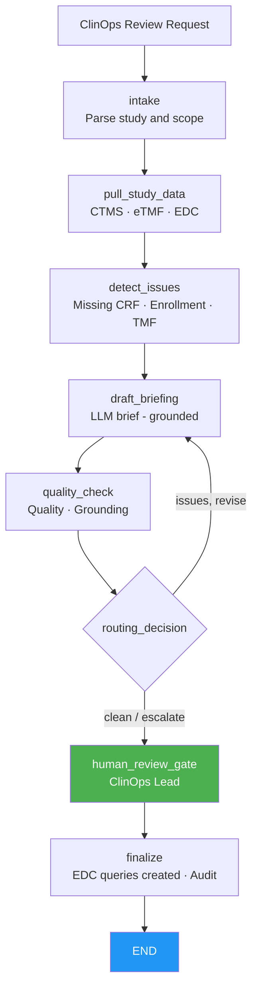

# Clinical Trial Operations Agent
## AI-assisted study health monitoring for clinical research teams

> **A LangGraph-orchestrated agent that pulls real-time data from CTMS, eTMF, and EDC systems, detects missing CRF data and protocol deviations, and drafts an operational briefing for ClinOps Lead review — with grounding verification and a mandatory human gate before any EDC query is created.**

---

## The Problem

Clinical operations teams managing multi-site studies face a relentless data-reconciliation burden:

- Study health data is spread across CTMS (enrollment), eTMF (document completeness), and EDC (subject-level CRF data) — reconciling them manually is time-consuming and error-prone.
- Missing CRF fields and open data queries accumulate unnoticed until a monitoring visit or audit surfaces them, creating last-minute remediation pressure.
- TMF completeness gaps are a top FDA inspection finding under ICH E6(R3) — teams need continuous awareness, not quarterly snapshots.
- Drafting a study health briefing for a ClinOps Lead or Sponsor requires pulling from all three systems, which a CRA may spend hours doing before each meeting.

Monitoring, data gap detection, and briefing drafting are exactly where agents add value: bounded, traceable, with a qualified human authorizing every action.

---

## What the Agent Does

A bounded workflow that mirrors how a CRA or ClinOps Lead actually monitors study health:

1. **Intake** — parse the review request (study ID, protocol, sponsor, review period, instructions).
2. **Pull study data** — retrieve enrollment status from CTMS, TMF completeness from eTMF, and subject/visit data from EDC via the MCP gateway.
3. **Detect issues** — flag missing CRF fields from subject data, calculate enrollment pace, visit completion rate, query rate, and TMF completeness gaps.
4. **Draft briefing** — the LLM drafts a study health briefing using ONLY the assembled data (Anthropic or in-account Bedrock); demo mode produces a grounded fallback without any API key.
5. **Quality check** — deterministic gates: grounding verification (every number/entity traceable to state) + no speculative language + required structural elements present.
6. **Routing** — clean → human review; issues → one bounded revision loop.
7. **Human review gate** — ClinOps Lead reviews the briefing and data flags. **Framework-enforced** via `interrupt_before`.
8. **Finalize** — only with verified human approval does the gateway create EDC data queries (high-risk write) and lock the audit trail.

**The AI surfaces and drafts. A qualified ClinOps Lead authorizes every EDC action.**

---

## Regulatory Compliance

| Regulation / standard | Requirement | Agent implementation |
|---|---|---|
| **ICH E6(R3) GCP** | Investigator site oversight; data integrity | Automated detection of missing CRF fields and visit completion gaps |
| **eTMF / TMF Reference Model** | Document completeness by inspection readiness | TMF completeness percentage surfaced per review cycle |
| **21 CFR Part 11** | Audit trail; electronic records | Append-only audit entries per node; reviewer identity bound at approval |
| **FDA Data Integrity Guidance** | ALCOA+ (attributable, accurate, traceable) | Grounding verification; all numbers traceable to CTMS/eTMF/EDC state |
| **ICH E6(R3) Risk-Based Monitoring** | Centralized statistical monitoring | Query-rate and enrollment-pace thresholds configurable per study |
| **GxP computer system assurance** | Validation evidence | Deterministic demo mode; prompt registry; eval harness in CI |

See [docs/regulatory-compliance.md](docs/regulatory-compliance.md).

---

## Architecture



Every system-of-record call flows through the **MCP authorization gateway** (reference logic for Amazon Bedrock AgentCore Gateway + Identity): deny-by-default authorization, least-privilege intersection, human approval for EDC writes, and PHI-masked audit. See [`../platform_core/hcls_agent_platform/mcp_gateway`](../platform_core/hcls_agent_platform/mcp_gateway/README.md).

---

## Systems Integration Map

| Category | Function | Common vendors |
|---|---|---|
| CTMS | Enrollment status, site metrics | Medidata Rave CTMS, Veeva Vault CTMS |
| eTMF | Document completeness, audit readiness | Veeva Vault eTMF, Wingspan, Trial Interactive |
| EDC | Subject data, CRF completion, queries | Medidata Rave, Oracle Clinical One, Veeva Vault EDC |
| LLM | Briefing drafting | Anthropic Claude, AWS Bedrock (in-account) |

See [docs/integration-guide.md](docs/integration-guide.md).

---

## Quick Start (local, no API key)

```bash
cd 03-clinical-trial-ops-agent
python -m venv venv && source venv/bin/activate     # Windows: venv\Scripts\activate
pip install -r requirements.txt
pip install -e ../platform_core
export EXTRACT_MODE=demo            # deterministic drafts, no API key
streamlit run app.py               # http://localhost:8501
```

Run the tests:

```bash
EXTRACT_MODE=demo pytest tests/ -q
```

Deploy to AWS: see [docs/aws-deployment-guide.md](docs/aws-deployment-guide.md), the CloudFormation quick-deploy in [`../infra/cloudformation`](../infra/cloudformation), and the AWS-native reference architecture in [`../aws-native-reference`](../aws-native-reference).

---

## ROI (illustrative)

| Metric | Before | After | Improvement |
|---|---|---|---|
| Time to prepare study health briefing | ~3 hours per meeting | ~20 minutes | **~90%** |
| Missing CRF fields caught between monitoring visits | manual spot-check | continuous automated detection | **systematic coverage** |
| TMF completeness visibility | quarterly audit | per-review-cycle | **near-real-time** |

---

## Project Structure

```
03-clinical-trial-ops-agent/
├── app.py                       # Streamlit dashboard
├── agent/                       # graph, state, nodes, prompts, persistence
├── tools/                       # gateway_tools, study_briefer, quality_checker
├── data/                        # fixtures and sample study data (offline)
├── docs/                        # aws-deployment, regulatory-compliance
├── tests/                       # tool + graph tests (demo mode)
├── Dockerfile · docker-compose.yml · railway.toml · requirements.txt · .env.example
```

---

## Compliance Disclaimer

This is a decision-support tool for qualified clinical operations professionals. AI-generated briefings require review and approval by a ClinOps Lead or CRA before any EDC queries are created or site actions are initiated. The AI never creates queries or modifies trial data autonomously. Validate per your GxP/computer-system-assurance and model-risk procedures before production use.
