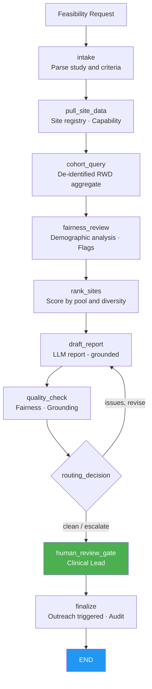

# Site & Patient Matching Agent
## AI-assisted site feasibility and diversity-aware patient matching for clinical trials

> **A LangGraph-orchestrated agent that queries de-identified real-world data to estimate eligible patient pools by site, ranks sites by feasibility, flags demographic under-representation, and drafts a matching report — with fairness checks and a mandatory human gate before any site outreach begins.**

---

## The Problem

Clinical trial site selection and patient identification are among the most consequential and most manual steps in trial startup:

- Selecting sites without systematic eligibility data leads to chronic under-enrollment — the single largest driver of trial delays and cost overruns.
- FDA's Diversity Action Plan requirements (2024 final guidance) mandate proactive demographic analysis; teams that rely on historical site experience alone cannot demonstrate due diligence.
- Querying patient populations across sites requires PHI-sensitive data infrastructure that, when done manually, creates de-identification risk and reproducibility gaps.
- Feasibility assessments are typically point-in-time Excel exercises, not auditable, reproducible workflows connected to live data.

Automated, auditable, diversity-aware feasibility assessment is a high-value, bounded use case for agents: the AI estimates and ranks; a clinical team lead authorizes every outreach decision.

---

## What the Agent Does

A bounded workflow that mirrors how a feasibility or epidemiology team actually selects sites:

1. **Intake** — parse the matching request (study ID, indication, eligibility criteria, target enrollment).
2. **Pull site data** — retrieve site capability and status information from the site registry via the MCP gateway.
3. **Cohort query** — run a de-identified aggregate patient cohort query against the RWD platform to estimate eligible patient pools per site.
4. **Fairness review** — evaluate demographic distribution of the eligible cohort against diversity benchmarks; flag under-represented groups.
5. **Rank sites** — score and rank sites by eligible pool size, site capability, and diversity profile.
6. **Draft report** — the LLM drafts a feasibility and matching report using ONLY the assembled data; demo mode produces a grounded fallback without any API key.
7. **Quality check** — deterministic gates: grounding verification + no speculative language + required structural elements + PHI/de-identification note present.
8. **Routing** — clean → human review; fairness or grounding issues → one bounded revision.
9. **Human review gate** — clinical team lead reviews rankings and fairness flags. **Framework-enforced** via `interrupt_before`.
10. **Finalize** — only with verified human approval does the gateway trigger site outreach workflow and lock the audit trail.

**The AI estimates and ranks. A clinical lead authorizes every outreach decision.**

---

## Regulatory Compliance

| Regulation / standard | Requirement | Agent implementation |
|---|---|---|
| **FDA Diversity Action Plan (2024)** | Proactive demographic analysis for enrollment | Fairness checker flags under-represented groups with severity rating |
| **GCP ICH E6(R3)** | Site qualification and oversight | Site capability data pulled from registry; audit trail per review |
| **HIPAA minimum necessary (45 CFR 164.514)** | De-identification of patient data | Cohort query returns aggregate counts only; PHI remains at source; note required in report |
| **De-identification safe harbor / expert determination** | Patient-level data not transmitted | Gateway enforces aggregate-only RWD query; phi_note required in cohort result |
| **21 CFR Part 11** | Audit trail; electronic authorization | Append-only audit entries; reviewer identity bound at approval before outreach |
| **GxP data integrity (ALCOA+)** | Traceable, accurate feasibility estimates | Grounding check; all counts traceable to cohort query state |

See [docs/regulatory-compliance.md](docs/regulatory-compliance.md).

---

## Architecture



Every system-of-record call flows through the **MCP authorization gateway** (reference logic for Amazon Bedrock AgentCore Gateway + Identity): deny-by-default, aggregate-only RWD queries, human approval for outreach writes, PHI-masked audit. See [`../platform_core/hcls_agent_platform/mcp_gateway`](../platform_core/hcls_agent_platform/mcp_gateway/README.md).

---

## Systems Integration Map

| Category | Function | Common vendors |
|---|---|---|
| Site registry | Site capability, activation status | CTMS, internal site database |
| Real-world data platform | De-identified aggregate patient cohort queries | TriNetX, Flatiron, Veeva Link, IQVIA |
| Diversity / benchmark data | Population demographic benchmarks | Census data, FDA diversity guidance benchmarks |
| LLM | Feasibility report drafting | Anthropic Claude, AWS Bedrock (in-account) |

---

## Quick Start (local, no API key)

```bash
cd 04-site-patient-matching-agent
python -m venv venv && source venv/bin/activate     # Windows: venv\Scripts\activate
pip install -r requirements.txt
pip install -e ../platform_core
export EXTRACT_MODE=demo            # deterministic drafts, no API key
streamlit run app.py               # http://localhost:8501
```

Run the tests:

```bash
EXTRACT_MODE=demo pytest tests/ -q
```

Deploy to AWS: see [docs/aws-deployment-guide.md](docs/aws-deployment-guide.md) and [`../infra/cloudformation`](../infra/cloudformation).

---

## ROI (illustrative)

| Metric | Before | After | Improvement |
|---|---|---|---|
| Time to complete site feasibility assessment | 2–4 weeks | 1–2 days | **~80%** |
| Diversity gap identification | ad hoc, post-enrollment | proactive, pre-activation | **systematic** |
| Reproducibility of feasibility evidence | low (Excel, email) | full audit trail | **audit-ready** |

---

## Project Structure

```
04-site-patient-matching-agent/
├── app.py                       # Streamlit dashboard
├── agent/                       # graph, state, nodes, prompts, persistence
├── tools/                       # gateway_tools, site_ranker, fairness_checker
├── data/                        # fixtures and sample eligibility criteria (offline)
├── docs/                        # aws-deployment, regulatory-compliance
├── tests/                       # tool + graph tests (demo mode)
├── Dockerfile · docker-compose.yml · railway.toml · requirements.txt · .env.example
```

---

## Compliance Disclaimer

This is a decision-support tool for qualified clinical and epidemiology professionals. All patient data accessed is aggregate and de-identified; PHI remains at source systems. AI-generated site rankings and feasibility estimates require review and approval by a clinical team lead before any site outreach is initiated. The AI never contacts sites or patients autonomously. Validate per your GxP/computer-system-assurance and model-risk procedures before production use.
