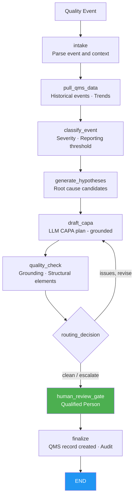

# Quality & CAPA Agent
## AI-assisted corrective and preventive action planning for regulated manufacturing

> **A LangGraph-orchestrated agent that ingests quality event data (complaints, deviations, OOS results), queries similar historical events in the QMS, classifies severity, drafts a CAPA plan, and routes it to a Qualified Person for review — with grounding verification and a mandatory human gate before any QMS record is created.**

---

## The Problem

Quality management in medical device and pharmaceutical manufacturing is documentation-intensive and high-stakes:

- A single complaint or deviation can trigger a CAPA that, if handled incorrectly, becomes a major FDA Form 483 observation or a Warning Letter finding.
- QA teams spend significant time searching historical QMS records for similar events, drafting root-cause hypotheses, and assembling corrective/preventive action plans — work that is largely information retrieval and structured prose.
- FDA's Quality Management System Regulation (QMSR, effective February 2026) aligns with ISO 13485 and increases expectations for systematic root-cause analysis and CAPA effectiveness monitoring.
- MDR vigilance reporting deadlines (21 CFR 803, EU MDR Article 87) add time pressure: the classification and initial CAPA framing must begin immediately after event intake.

CAPA drafting is a bounded, high-value use case for agents: the AI searches, classifies, and drafts; a Qualified Person reviews, approves, and owns every record.

---

## What the Agent Does

A bounded workflow that mirrors how a QA Manager handles a quality event:

1. **Intake** — parse the quality event (complaint/deviation/OOS, product, lot, site, description, severity classification).
2. **Pull QMS data** — retrieve similar historical events from the QMS to identify trends and recurrence patterns.
3. **Classify event** — determine severity (CRITICAL/MAJOR/MINOR) and assess whether MDR/vigilance reporting thresholds may be met.
4. **Generate root cause hypotheses** — systematic hypothesis generation (five-why, fishbone categories) based on event type and description.
5. **Draft CAPA plan** — the LLM drafts a complete CAPA plan (containment, root cause investigation, corrective actions, preventive actions, effectiveness monitoring) using ONLY the assembled event data; demo mode produces a grounded fallback without any API key.
6. **Quality check** — deterministic gates: grounding verification + no speculative causal language + all required CAPA elements present.
7. **Routing** — clean → QP review; grounding or structural issues → one bounded revision.
8. **Human review gate** — Qualified Person reviews the CAPA plan and classification. **Framework-enforced** via `interrupt_before`.
9. **Finalize** — only with verified QP approval does the gateway create the QMS CAPA record (high-risk write) and lock the audit trail.

**The AI classifies and drafts. A Qualified Person authorizes every QMS record.**

---

## Regulatory Compliance

| Regulation / standard | Requirement | Agent implementation |
|---|---|---|
| **FDA QMSR (21 CFR 820, eff. Feb 2026)** | Systematic CAPA process; root cause analysis | Five-why / fishbone hypothesis generation; corrective + preventive action sections |
| **ISO 13485:2016** | CAPA procedure; effectiveness verification | Effectiveness monitoring section with recurrence metric and time window |
| **21 CFR Part 11** | Audit trail; electronic records and signatures | Append-only audit entries per node; QP identity bound at approval |
| **EU MDR Vigilance (Art. 87–90)** | Serious incident reporting; trend reporting | Severity classification and regulatory assessment section in CAPA draft |
| **21 CFR 803 MDR** | Medical device reporting thresholds | Regulatory assessment note in CAPA plan; QP responsible for final determination |
| **GxP data integrity (ALCOA+)** | Accurate, traceable quality records | Grounding verification; all claims traceable to event and QMS state |

See [docs/regulatory-compliance.md](docs/regulatory-compliance.md).

---

## Architecture



Every system-of-record call flows through the **MCP authorization gateway**: deny-by-default, human approval for QMS record creation, and PHI-masked audit. See [`../platform_core/hcls_agent_platform/mcp_gateway`](../platform_core/hcls_agent_platform/mcp_gateway/README.md).

---

## Systems Integration Map

| Category | Function | Common vendors |
|---|---|---|
| Quality management system | Historical events, complaints, CAPA records | Veeva Vault QMS, MasterControl, Pilgrim SmartSolve |
| ERP / MES | Lot and batch records, material traceability | SAP, Oracle, Tulip |
| Document management | SOP library, training records | Veeva Vault, OpenText |
| LLM | CAPA plan drafting | Anthropic Claude, AWS Bedrock (in-account) |

---

## Quick Start (local, no API key)

```bash
cd 05-quality-capa-agent
python -m venv venv && source venv/bin/activate     # Windows: venv\Scripts\activate
pip install -r requirements.txt
pip install -e ../platform_core
export EXTRACT_MODE=demo            # deterministic drafts, no API key
streamlit run app.py               # http://localhost:8501
```

Run the tests:

```bash
EXTRACT_MODE=demo pytest tests/ -q
```

Deploy to AWS: see [docs/aws-deployment-guide.md](docs/aws-deployment-guide.md) and [`../infra/cloudformation`](../infra/cloudformation).

---

## ROI (illustrative)

| Metric | Before | After | Improvement |
|---|---|---|---|
| Time to first CAPA plan draft | 4–8 hours | ~30 minutes | **~85%** |
| Historical event search coverage | manual, sample-based | systematic QMS query | **complete** |
| CAPA elements present at QP review | varies by author | enforced by structural gate | **consistent** |

---

## Project Structure

```
05-quality-capa-agent/
├── app.py                       # Streamlit dashboard
├── agent/                       # graph, state, nodes, prompts, persistence
├── tools/                       # gateway_tools, capa_drafter, quality_checker
├── data/                        # fixtures and sample quality events (offline)
├── docs/                        # aws-deployment, regulatory-compliance
├── tests/                       # tool + graph tests (demo mode)
├── Dockerfile · docker-compose.yml · railway.toml · requirements.txt · .env.example
```

---

## Compliance Disclaimer

This is a decision-support tool for qualified quality assurance professionals. AI-generated CAPA plans require review and approval by a Qualified Person before any QMS record is created or corrective actions are initiated. The AI never creates QMS records or initiates regulatory reports autonomously. Validate per your GxP/computer-system-assurance and model-risk procedures before production use.
