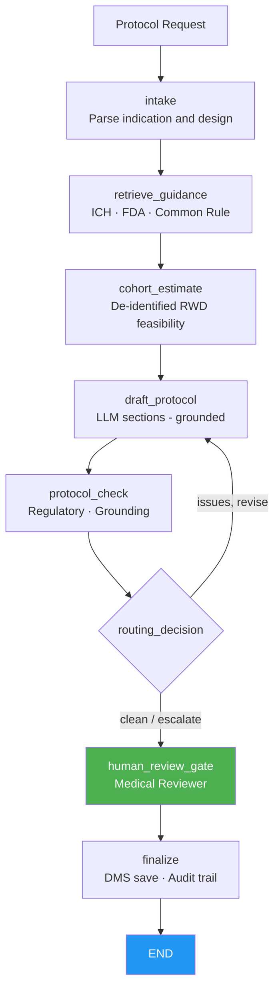

# Protocol Design Agent
## AI-assisted clinical study protocol drafting for sponsors and CROs

> **A LangGraph-orchestrated agent that retrieves applicable regulatory guidance, queries de-identified real-world data for feasibility estimates, and drafts key protocol sections (endpoints, eligibility, study schedule) — with regulatory and grounding checks and a mandatory qualified medical reviewer gate before finalization.**

---

## The Problem

Protocol design is one of the most consequential and most time-consuming activities in drug and device development:

- A poorly designed protocol — wrong primary endpoint, loose eligibility criteria, under-powered sample size — can invalidate a Phase 3 study that cost hundreds of millions of dollars.
- Medical writers and clinical scientists spend weeks assembling guidance documents (ICH E6, E8, E9, Common Rule), drafting sections, and reconciling them with regulatory expectations.
- First-in-human (FIH) and early-phase protocol development requires synthesis of toxicology, PK/PD, and regulatory precedent simultaneously — a task that spans multiple functions and document repositories.
- Protocol amendments are expensive: each amendment costs on average several weeks of timeline and hundreds of thousands of dollars in site and IRB re-work.

Guidance retrieval, feasibility estimation, and first-draft section generation are exactly where agents accelerate: they surface the right regulatory context, ground the draft in real-world data, and let clinical scientists focus on scientific reasoning rather than document assembly.

---

## What the Agent Does

A bounded workflow that mirrors how a clinical scientist and medical writer collaborate on protocol design:

1. **Intake** — parse the protocol request (indication, phase, therapeutic area, primary objective, target population, study design, instructions).
2. **Retrieve guidance** — search applicable regulatory guidance documents (ICH E6/E8/E9, FDA disease-specific guidance, Common Rule for academic sponsors) from the guidance library.
3. **Cohort estimate** — query de-identified real-world data to estimate the eligible patient population for the planned eligibility criteria across the intended site network.
4. **Draft protocol sections** — the LLM drafts key sections (endpoints, eligibility, study schedule) using ONLY the assembled guidance and cohort data; demo mode produces a grounded fallback without any API key.
5. **Protocol check** — deterministic gates: grounding verification + no absolute efficacy/safety claims + required structural elements (endpoint, eligibility, schedule, reviewer note) present.
6. **Routing** — clean → medical reviewer gate; issues → one bounded revision.
7. **Human review gate** — qualified medical or clinical reviewer approves. **Framework-enforced** via `interrupt_before`.
8. **Finalize** — only with verified reviewer approval does the gateway save the protocol draft to the document management system and lock the audit trail.

**The AI assembles guidance and drafts sections. A qualified medical reviewer authorizes every protocol artifact.**

---

## Regulatory Compliance

| Regulation / standard | Requirement | Agent implementation |
|---|---|---|
| **ICH E6(R3) GCP** | Protocol content requirements; investigator oversight | Required protocol elements enforced by structural check |
| **ICH E8(R1)** | General considerations for clinical studies; quality by design | Study design and objective framing aligned to E8 principles |
| **ICH E9(R1)** | Statistical principles for clinical trials; estimands | Endpoint section references estimand framework; guidance retrieval surfaces E9(R1) |
| **45 CFR 46 (Common Rule)** | IRB review; informed consent requirements | Eligibility section prompts inclusion of consent capacity criterion |
| **First-in-human (FIH) guidance** | Dose-escalation design; SUSAR stopping rules | Phase 1 template includes safety monitoring committee and stopping rule sections |
| **21 CFR Part 11** | Audit trail; electronic records | Append-only audit entries per node; reviewer identity bound at approval |
| **GxP data integrity (ALCOA+)** | Accurate, traceable protocol claims | Grounding check; all numbers traceable to cohort estimate and guidance state |

See [docs/regulatory-compliance.md](docs/regulatory-compliance.md).

---

## Architecture



Every system-of-record call flows through the **MCP authorization gateway**: deny-by-default, aggregate-only RWD queries, human approval for DMS writes, and PHI-masked audit. See [`../platform_core/hcls_agent_platform/mcp_gateway`](../platform_core/hcls_agent_platform/mcp_gateway/README.md).

---

## Systems Integration Map

| Category | Function | Common vendors |
|---|---|---|
| Guidance library | ICH, FDA, EMA guidance retrieval | Veeva Vault, internal DMS, FDA.gov API |
| Real-world data platform | De-identified cohort feasibility estimates | TriNetX, Flatiron, IQVIA, Komodo |
| Document management | Protocol draft storage and versioning | Veeva Vault, SharePoint, OpenText |
| LLM | Protocol section drafting | Anthropic Claude, AWS Bedrock (in-account) |

---

## Quick Start (local, no API key)

```bash
cd 06-protocol-design-agent
python -m venv venv && source venv/bin/activate     # Windows: venv\Scripts\activate
pip install -r requirements.txt
pip install -e ../platform_core
export EXTRACT_MODE=demo            # deterministic drafts, no API key
streamlit run app.py               # http://localhost:8501
```

Run the tests:

```bash
EXTRACT_MODE=demo pytest tests/ -q
```

Deploy to AWS: see [docs/aws-deployment-guide.md](docs/aws-deployment-guide.md) and [`../infra/cloudformation`](../infra/cloudformation).

---

## ROI (illustrative)

| Metric | Before | After | Improvement |
|---|---|---|---|
| Time to first complete protocol draft | 3–6 weeks | 3–5 days | **~75%** |
| Guidance documents reviewed per protocol | manual, ad hoc | systematic library retrieval | **comprehensive** |
| Protocol amendment rate (illustrative) | baseline | reduced by earlier feasibility grounding | **earlier risk detection** |

---

## Project Structure

```
06-protocol-design-agent/
├── app.py                       # Streamlit dashboard
├── agent/                       # graph, state, nodes, prompts, persistence
├── tools/                       # gateway_tools, protocol_drafter, protocol_checker
├── data/                        # fixtures and sample protocol requests (offline)
├── docs/                        # aws-deployment, regulatory-compliance
├── tests/                       # tool + graph tests (demo mode)
├── Dockerfile · docker-compose.yml · railway.toml · requirements.txt · .env.example
```

---

## Compliance Disclaimer

This is a decision-support tool for qualified medical and clinical professionals. AI-generated protocol sections require review and approval by a qualified medical reviewer before any submission to a health authority, ethics committee, or IRB. The AI never finalizes or submits protocols autonomously. Validate per your GxP/computer-system-assurance and model-risk procedures before production use.
