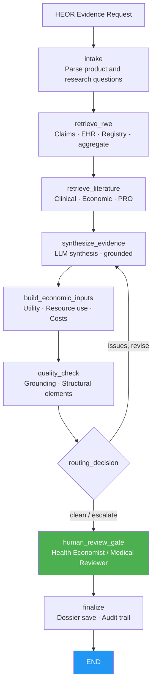

# RWE & HEOR Agent
## AI-assisted real-world evidence and health economics outcomes research synthesis

> **A LangGraph-orchestrated agent that retrieves and synthesizes de-identified real-world data, published literature, and economic models to produce an evidence summary for payer submissions, HTA dossiers, and formulary decisions — with grounding verification and a mandatory medical/health-economics reviewer gate before any output is finalized.**

---

## The Problem

Health economics and outcomes research teams face mounting pressure to generate and communicate real-world evidence faster and more rigorously:

- Payer submissions (dossiers, value dossiers, AMCP formulary submissions) require synthesis of RWE from multiple sources — claims data, EHR data, patient registries, published literature — a task that takes weeks of analyst time.
- HTA bodies (NICE, G-BA, HAS) increasingly require systematic, transparent evidence synthesis with explicit uncertainty quantification; ad hoc analyses no longer meet the bar.
- GDPR and US state privacy laws impose strict de-identification requirements on patient-level data used in HEOR; manual workflows create compliance risk.
- Economic model inputs (utility values, resource use, costs) must be traceable to published sources or primary analyses; unsupported assumptions are a common rejection reason.

Evidence retrieval, synthesis, and first-draft HEOR report generation are high-value, bounded agent use cases: the AI assembles and synthesizes; a qualified health economist or outcomes researcher reviews and owns the output.

---

## What the Agent Does

A bounded workflow that mirrors how a HEOR analyst builds a payer evidence package:

1. **Intake** — parse the evidence synthesis request (product, indication, comparator, target audience, research questions, instructions).
2. **Retrieve RWE** — query de-identified real-world databases (claims, EHR, registry) for outcomes data; enforce aggregate-only access.
3. **Retrieve literature** — search published literature (clinical, economic, PRO) for evidence relevant to the research questions.
4. **Synthesize evidence** — the LLM synthesizes retrieved evidence into a structured summary by research question, using ONLY the assembled data; demo mode produces a grounded fallback without any API key.
5. **Build economic inputs** — identify and tabulate utility values, resource use estimates, and cost inputs from the evidence base.
6. **Quality check** — deterministic gates: grounding verification (every number/entity traceable to retrieved evidence) + no unsupported absolute claims + required structural elements present.
7. **Routing** — clean → reviewer gate; issues → one bounded revision.
8. **Human review gate** — qualified health economist or medical reviewer approves. **Framework-enforced** via `interrupt_before`.
9. **Finalize** — only with verified reviewer approval does the gateway save the evidence summary to the dossier system and lock the audit trail.

**The AI retrieves and synthesizes. A qualified reviewer authorizes every evidence package.**

---

## Regulatory Compliance

| Regulation / standard | Requirement | Agent implementation |
|---|---|---|
| **FDA RWE Framework (2018 + 2021 guidance)** | Fit-for-purpose RWE; data source transparency | Data source and de-identification method recorded in audit trail per query |
| **ISPOR RWE Good Practices** | Transparent, reproducible evidence synthesis | All retrieved sources logged; synthesis grounded to retrieved corpus |
| **GDPR (Art. 89 — research exemption)** | Data minimization; de-identification for research | Aggregate-only RWD access enforced by gateway; no patient-level identifiers in state |
| **US state privacy laws (CCPA etc.)** | De-identified data standard | Gateway enforces de-identification contract; phi_note required in synthesis |
| **21 CFR Part 11** | Audit trail for regulated submissions | Append-only audit entries per node; reviewer identity bound at approval |
| **AMCP Format / HTA dossier standards** | Structured evidence presentation | Required structural elements (clinical, economic, PRO sections) enforced by quality gate |

See [docs/regulatory-compliance.md](docs/regulatory-compliance.md).

---

## Architecture



Every system-of-record call flows through the **MCP authorization gateway**: deny-by-default, aggregate-only RWD queries, human approval for dossier writes, and PHI-masked audit. See [`../platform_core/hcls_agent_platform/mcp_gateway`](../platform_core/hcls_agent_platform/mcp_gateway/README.md).

---

## Systems Integration Map

| Category | Function | Common vendors |
|---|---|---|
| Real-world data platforms | Claims, EHR, registry — de-identified aggregate | IQVIA, Optum, TriNetX, Flatiron, IBM MarketScan |
| Literature databases | Clinical and economic evidence | PubMed API, Embase, Cochrane |
| Economic model library | Utility values, cost inputs, published models | Internal model repository, published HTA reports |
| Dossier / submission system | Evidence package storage | Veeva Vault, IQVIA submissions platform |
| LLM | Evidence synthesis and drafting | Anthropic Claude, AWS Bedrock (in-account) |

---

## Quick Start (local, no API key)

```bash
cd 07-rwe-heor-agent
python -m venv venv && source venv/bin/activate     # Windows: venv\Scripts\activate
pip install -r requirements.txt
pip install -e ../platform_core
export EXTRACT_MODE=demo            # deterministic synthesis, no API key
streamlit run app.py               # http://localhost:8501
```

Run the tests:

```bash
EXTRACT_MODE=demo pytest tests/ -q
```

Deploy to AWS: see [docs/aws-deployment-guide.md](docs/aws-deployment-guide.md) and [`../infra/cloudformation`](../infra/cloudformation).

---

## ROI (illustrative)

| Metric | Before | After | Improvement |
|---|---|---|---|
| Time to first HEOR evidence summary | 3–6 weeks | 3–5 days | **~75%** |
| Data sources systematically searched | analyst-dependent | automated, logged | **reproducible** |
| Traceability of economic inputs | varies | grounding verification enforced | **submission-ready** |

---

## Project Structure

```
07-rwe-heor-agent/
├── app.py                       # Streamlit dashboard
├── agent/                       # graph, state, nodes, prompts, persistence
├── tools/                       # gateway_tools, evidence_synthesizer, rwe_checker
├── data/                        # fixtures and sample HEOR requests (offline)
├── docs/                        # aws-deployment, regulatory-compliance
├── tests/                       # tool + graph tests (demo mode)
├── Dockerfile · docker-compose.yml · railway.toml · requirements.txt · .env.example
```

---

## Compliance Disclaimer

This is a decision-support tool for qualified health economics and outcomes research professionals. AI-generated evidence summaries require review and approval by a qualified health economist or medical reviewer before inclusion in any payer submission, HTA dossier, or formulary package. The AI never submits evidence packages autonomously. Validate per your GxP/computer-system-assurance and model-risk procedures before production use.
