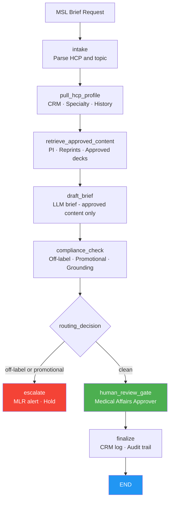

# Medical Affairs MSL Agent
## AI-assisted pre-call brief generation for Medical Science Liaisons

> **A LangGraph-orchestrated agent that pulls approved clinical data and HCP engagement history, drafts a compliant MSL pre-call brief grounded in on-label approved content only, and routes it through a medical affairs approver gate before any HCP interaction — with off-label detection, promotional-language blocking, and a mandatory human review step.**

---

## The Problem

Medical Science Liaisons operate at the intersection of scientific exchange and regulatory compliance — a demanding context where a single off-label or promotional statement can trigger FDA enforcement action:

- MSLs prepare for dozens of HCP interactions per month, each requiring a tailored scientific brief that reflects the specific HCP's specialty, interests, and prior engagement history.
- Every claim in a pre-call brief must be grounded in approved labeling and company-approved source documents; the MLR (Medical, Legal, Regulatory) review burden for customized briefs is high.
- Off-label promotion is a criminal violation under 21 USC 333; the risk of a compliant MSL inadvertently using non-approved language in a brief is non-trivial when briefs are drafted under time pressure without automated checks.
- The PhRMA Code on Interactions with Healthcare Professionals and FDA's promotional regulations require that scientific exchange be balanced, non-promotional, and grounded in approved data — standards that are difficult to enforce consistently across a large MSL field force.

Automated, compliance-enforced brief generation is a high-value, bounded use case for agents: the AI assembles approved content and drafts; a medical affairs approver reviews and signs off before any HCP contact.

---

## What the Agent Does

A bounded workflow that mirrors how a well-supported MSL prepares for a scientific exchange:

1. **Intake** — parse the brief request (HCP ID, topic, meeting date, meeting purpose, instructions).
2. **Pull HCP profile** — retrieve HCP background, specialty, clinical interests, and prior engagement history from the CRM.
3. **Retrieve approved content** — fetch company-approved documents (prescribing information, approved publication reprints, approved slide decks) relevant to the topic from the MLR-approved content library.
4. **Draft brief** — the LLM drafts the pre-call brief using ONLY the approved documents retrieved; demo mode produces a grounded, compliant fallback without any API key.
5. **Compliance check** — deterministic gates: off-label reference detection (prohibited, blocks release) + promotional language detection + required structural elements (HCP background, approved data citation, compliance note) present + grounding verification (all claims traceable to approved documents in state).
6. **Routing** — clean → medical affairs approver gate; off-label or promotional finding → escalate immediately.
7. **Human review gate** — medical affairs approver reviews the brief and compliance findings. **Framework-enforced** via `interrupt_before`.
8. **Finalize** — only with verified approver sign-off does the gateway log the interaction in the CRM and lock the audit trail.

**The AI retrieves approved content and drafts within the approved indication. A medical affairs approver authorizes every brief.**

---

## Regulatory Compliance

| Regulation / standard | Requirement | Agent implementation |
|---|---|---|
| **FDA promotional regulations (21 CFR 202)** | No false or misleading promotion; fair balance | Promotional-language gate blocks prohibited claims; balance enforced in template |
| **FDA off-label use rules (21 USC 333)** | No promotion of unapproved uses | Off-label detection gate blocks release; any off-label reference triggers escalation |
| **PhRMA Code on HCP Interactions** | Scientific exchange must be non-promotional; approved data only | Brief restricted to approved-document corpus; promotional-language gate |
| **Sunshine Act (42 USC 1320a-7h)** | Transfers of value to HCPs must be reported | CRM interaction logging in finalize node supports Sunshine Act tracking |
| **MLR review standards** | Medical, legal, regulatory pre-approval of claims | Approved-document corpus is the exclusive source; grounding gate enforces citation |
| **21 CFR Part 11** | Audit trail; electronic authorization | Append-only audit entries per node; approver identity bound at release |

See [docs/regulatory-compliance.md](docs/regulatory-compliance.md).

---

## Architecture



Every system-of-record call flows through the **MCP authorization gateway**: deny-by-default, approved-content-only document retrieval, human approval before CRM write, and full audit. See [`../platform_core/hcls_agent_platform/mcp_gateway`](../platform_core/hcls_agent_platform/mcp_gateway/README.md).

---

## Systems Integration Map

| Category | Function | Common vendors |
|---|---|---|
| CRM / MSL platform | HCP profiles, engagement history, interaction logging | Veeva CRM, Salesforce Health Cloud, IQVIA Orchestrated Customer Engagement |
| MLR-approved content library | Prescribing information, approved reprints, approved slides | Veeva Vault PromoMats, Zinc, Aprimo |
| Medical information system | Approved medical information responses | Veeva Vault MedComms, Epiq |
| LLM | Pre-call brief drafting | Anthropic Claude, AWS Bedrock (in-account) |

---

## Quick Start (local, no API key)

```bash
cd 08-medical-affairs-msl-agent
python -m venv venv && source venv/bin/activate     # Windows: venv\Scripts\activate
pip install -r requirements.txt
pip install -e ../platform_core
export EXTRACT_MODE=demo            # deterministic drafts, no API key
streamlit run app.py               # http://localhost:8501
```

Run the tests:

```bash
EXTRACT_MODE=demo pytest tests/ -q
```

Deploy to AWS: see [docs/aws-deployment-guide.md](docs/aws-deployment-guide.md) and [`../infra/cloudformation`](../infra/cloudformation).

---

## ROI (illustrative)

| Metric | Before | After | Improvement |
|---|---|---|---|
| Time to prepare MSL pre-call brief | 45–90 minutes | ~10 minutes | **~85%** |
| Off-label content caught before HCP contact | manual review, inconsistent | automated gate, every brief | **systematic** |
| MLR review burden for customized briefs | high (manual, per brief) | reduced (gate pre-screens) | **focused review** |

---

## Project Structure

```
08-medical-affairs-msl-agent/
├── app.py                       # Streamlit dashboard
├── agent/                       # graph, state, nodes, prompts, persistence
├── tools/                       # gateway_tools, brief_drafter, compliance_checker
├── data/                        # fixtures and sample HCP profiles (offline)
├── docs/                        # aws-deployment, regulatory-compliance
├── tests/                       # tool + graph tests (demo mode)
├── Dockerfile · docker-compose.yml · railway.toml · requirements.txt · .env.example
```

---

## Compliance Disclaimer

This is a decision-support tool for qualified medical affairs professionals. AI-generated MSL briefs require review and approval by a medical affairs approver before any HCP interaction. The AI never contacts HCPs or initiates external communications autonomously. All content is restricted to approved, on-label materials. Any off-label reference detected by the compliance gate triggers immediate escalation and hold — the brief is not released. Validate per your promotional compliance, MLR review, and model-risk procedures before production use.
