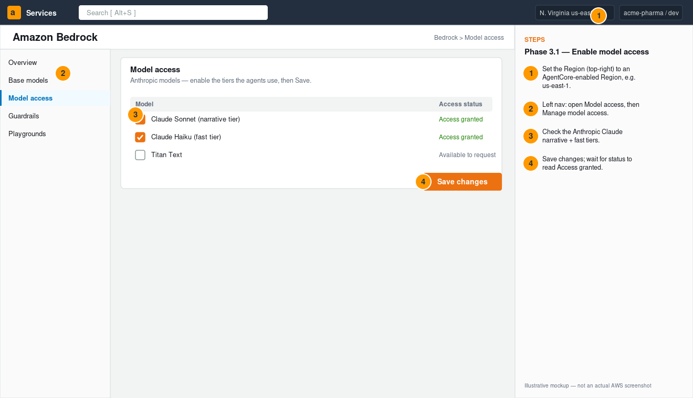
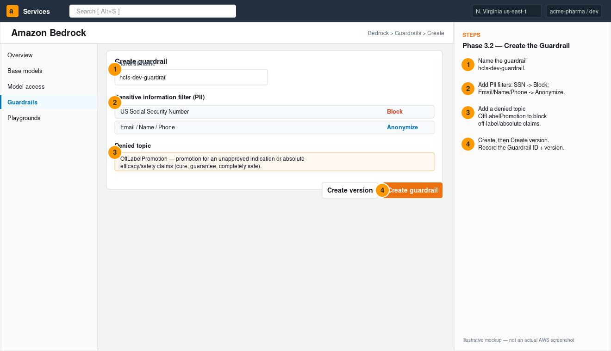
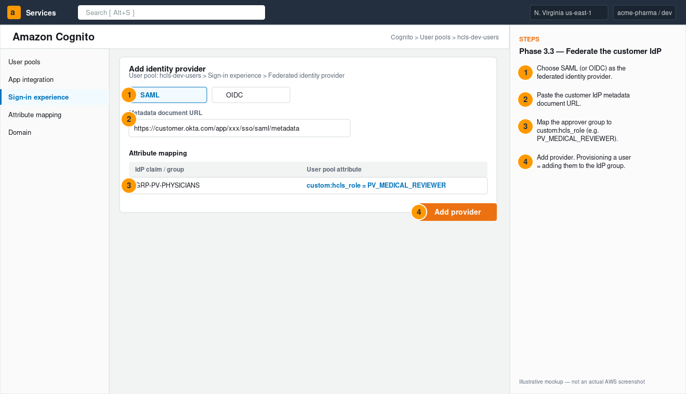
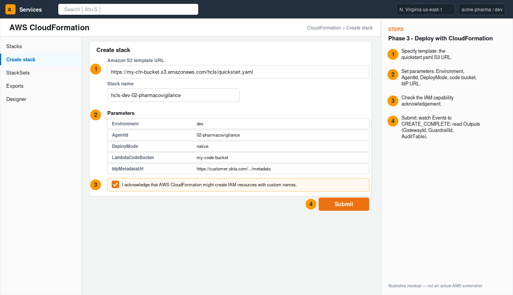
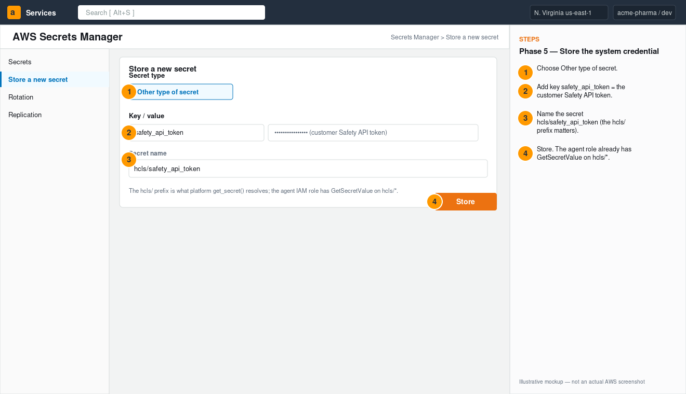
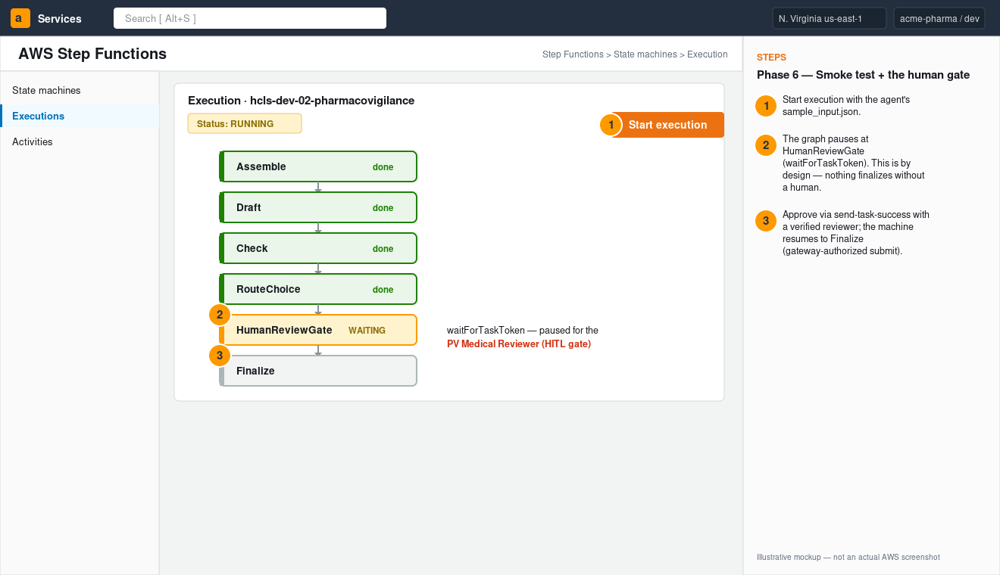
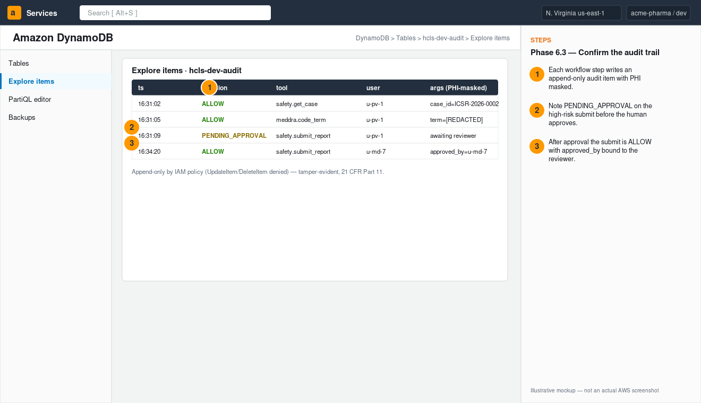

# Deployment Handbook
### Deploying an HCLS agent to AWS — step by step, console and CLI

> **Audience:** the SI delivery engineer / cloud architect standing up one agent in a
> customer's AWS account for the first time. This is the "do exactly this" book. It
> covers both the **AWS Console** (click path) and the **CLI** equivalent for every
> step, from an empty account to a running, governed, human-gated agent.
>
> **Worked example:** Agent 02 — Pharmacovigilance (ICSR Case Intake). Every step
> generalizes to the other seven agents via the **Per-Agent Appendix** at the end —
> only the `AgentId`, the systems you connect, the high-risk tools, and the approver
> role change.

---

## 0. How to use this handbook

There are two deployment shapes; the handbook walks the **native** shape end to end
(it's the higher-fidelity, fully-managed target) and notes the container differences inline.

| Shape | What runs | When to choose |
|---|---|---|
| **Container lift** | The LangGraph agent image on **Bedrock AgentCore Runtime** (or ECS Fargate) | Fastest; you want the agent code unchanged |
| **Native rebuild** (this book) | Deterministic steps in **Lambda**, drafting via **Strands/Bedrock**, orchestrated by **Step Functions** with a `waitForTaskToken` human gate | Highest fidelity to managed-serverless; clearest audit & HITL story |

Both deploy through the **same CloudFormation quickstart** (`infra/cloudformation/quickstart.yaml`)
— `DeployMode=native` vs `DeployMode=container`. Both put every system-of-record call
behind the **MCP authorization gateway**, which itself has two interchangeable
implementations selected by the **`GatewayMode`** parameter:

| `GatewayMode` | MCP front door | Region support |
|---|---|---|
| `portable` (default) | API Gateway (HTTP API) + Cognito JWT authorizer | **any commercial Region** — use this in a new account |
| `agentcore` | Amazon Bedrock **AgentCore Gateway + Identity** | AgentCore-enabled Regions only |

Both route to the **same connector Lambdas** (`connectors.yaml`, one per system of record)
which run every call through `platform_core`'s deny-by-default policy. This handbook shows
the AgentCore path; the portable path is identical except for the gateway stack.

> **In a hurry / new account?** [`DEPLOY-QUICKSTART.md`](DEPLOY-QUICKSTART.md) is the
> opinionated copy-paste path (two scripts, ~30–60 min). This handbook is the deep
> console walkthrough with screenshots and per-control explanations.

**Time budget:** ~2–4 hours for a first dev deployment once prerequisites are granted.

> **Polished PDF leave-behind:** a print-ready, branded PDF of this handbook (cover + all figures) is at [`../HCLS-Deployment-Handbook.pdf`](../HCLS-Deployment-Handbook.pdf).

> **Console mockups:** labeled, illustrative AWS Console screens for the key steps are embedded inline (Figures 1–7) and stored in `docs/assets/console/` (PNG + SVG source).

**Two ways to do Phase 1 (account foundation):** the quickstart CloudFormation creates
KMS, the Bedrock Guardrail, Cognito, IAM, audit/WORM storage **for you**. This book shows
the **manual console steps too**, so you understand (and can demo to a customer's security
team) exactly what each control is. If you trust the CFN, you can skip the manual sub-steps
marked _(CFN does this)_ and jump to Phase 2.

---

## 1. Roles & prerequisites

| You need | Who provides it | Notes |
|---|---|---|
| An AWS account / sandbox with admin (or the scoped deploy policy) | Customer cloud team | Dev environment first; never start in prod |
| **Amazon Bedrock model access** for Claude | Account admin | One-time per account+region (Phase 3.1) |
| A **Region that supports Bedrock AgentCore** | Architect | e.g. `us-east-1`; confirm AgentCore availability before you start |
| Enterprise **IdP** metadata (Okta/Entra/AD) | Customer identity team | SAML/OIDC metadata URL for Cognito federation |
| The system-of-record endpoint(s) + an API token | Customer system owner (e.g. PV/Safety team) | For Agent 02: the Argus/Veeva Safety REST base URL + token. You can deploy against the bundled reference service first. |
| Local tooling | You | AWS CLI v2, Docker or Finch (ARM64 builds), Python 3.11, `zip` |

**Decision rights to confirm before you touch the console:** who is the named **approver
role** for this agent's high-risk actions (Agent 02 = `PV_MEDICAL_REVIEWER`), and who signs
the **computer-system validation** at go-live.

---

## 2. Pre-flight (local machine)

```bash
aws --version                       # v2.x
aws configure                       # set keys + default region (use an AgentCore region)
aws sts get-caller-identity         # confirm the right account
python3 --version                   # 3.11+
docker version                      # (container path only) confirm buildx/ARM64
```

Clone the repo and confirm it runs offline first — this is your fallback demo and your
sanity check that the agent logic is healthy before any cloud spend:

```bash
cd 02-pharmacovigilance-agent
python -m venv venv && source venv/bin/activate
pip install -r requirements.txt && pip install -e ../platform_core
EXTRACT_MODE=demo pytest tests/ -q          # expect: all pass
EXTRACT_MODE=demo PYTHONPATH=.:../platform_core python demo/demo_live.py   # full run, local
```

---

## 3. Phase 1 — Account foundation

### 3.1 Enable Bedrock model access (Console)

This must be done once per account+region or every inference call fails with AccessDenied.

1. Sign in to the **AWS Management Console**; set the Region (top-right) to your target Region.
2. Search for **Bedrock** → open **Amazon Bedrock**.
3. Left nav → **Model access** → **Manage model access** (or **Modify model access**).
4. Check the **Anthropic – Claude** models you intend to use (the narrative + fast tiers).
5. **Save / Request access.** Access for Anthropic models is typically granted immediately; wait until status shows **Access granted**.


*Figure 1. Amazon Bedrock → Model access: enable the Claude narrative + fast tiers (illustrative mockup, not an actual AWS screenshot).*


CLI check:
```bash
aws bedrock list-foundation-models --region us-east-1 \
  --query "modelSummaries[?contains(modelId,'anthropic.claude')].modelId" --output table
```

### 3.2 Create a Bedrock Guardrail _(CFN does this — `security.yaml`)_

The Guardrail is your PHI + off-label safety net on every inference. The quickstart
creates one named `hcls-<env>-guardrail`. To create/inspect manually in the Console:

1. **Bedrock** → left nav **Guardrails** → **Create guardrail**.
2. Name it `hcls-dev-guardrail`. Add a **Sensitive information filter**: set **US SSN → Block**, **Email/Name/Phone → Anonymize**.
3. Add a **Denied topic** "OffLabelPromotion" (definition: promotion for an unapproved indication or absolute efficacy/safety claims).
4. **Create**, then **Create version** (note the **Guardrail ID** and **Version** — you'll pass the ID to the stack).


*Figure 2. Bedrock → Guardrails: PHI filters + off-label denied topic (illustrative mockup, not an actual AWS screenshot).*


### 3.3 Cognito user pool + IdP federation _(CFN does this — `security.yaml`)_

Identity is how the gateway knows *who* is acting and whether they may approve. The
quickstart creates the pool; you connect it to the customer IdP:

1. **Amazon Cognito** → **User pools** → open `hcls-dev-users` (created by the stack).
2. **Sign-in experience** → **Federated identity provider sign-in** → **Add identity provider** → **SAML** (or OIDC).
   *(When `IdpMetadataUrl` is set the stack creates this `UserPoolIdentityProvider`, the hosted-UI domain,
   and the federated app-client wiring for you — see `IDP-FEDERATION-RUNBOOK.md` for Okta/Entra specifics.)*
3. Paste the customer's **metadata document URL** (the `IdpMetadataUrl` you'll also pass to the stack).
4. **Attribute mapping:** map the IdP group/claim that designates the approver to the custom attribute **`custom:hcls_role`** (e.g. group `GRP-PV-PHYSICIANS` → `PV_MEDICAL_REVIEWER`).
5. Save. Provisioning a user = adding them to the IdP group; no accounts are managed in AWS.


*Figure 3. Cognito → Sign-in experience: federate the IdP and map the approver to custom:hcls_role (illustrative mockup, not an actual AWS screenshot).*


### 3.4 KMS key _(CFN does this — `security.yaml`)_

The stack creates a per-environment CMK (`alias/hcls-dev`) with rotation enabled and uses
it to encrypt the audit table, review table, and WORM bucket. No manual step needed unless
you are bringing your own key (then note its ARN).

---

## 4. Phase 2 — Stage the artifacts

CloudFormation needs (a) the component templates in S3 and (b) the agent's Lambda code in S3.
The container path also needs an image in ECR.

### 4.1 Create an S3 bucket and upload the templates (Console + CLI)

Console: **S3** → **Create bucket** → name `my-cfn-bucket` (Block Public Access ON) → Create.
Then upload, or via CLI:

```bash
aws s3 mb s3://my-cfn-bucket
aws s3 cp infra/cloudformation/ s3://my-cfn-bucket/hcls/ --recursive --exclude "*" --include "*.yaml"
```

### 4.2 Package the agent + connector Lambda code (native path)

Use the build script — it vendors third-party dependencies (Strands SDK) **and**
`platform_core` into each zip, which a bare `zip` of the source does not (that omission
is the classic `ImportError` on cold start). It also builds the shared `connector.zip`
that backs every gateway target.

```bash
scripts/build_lambdas.sh 02-pharmacovigilance      # -> build/lambdas.zip + connector.zip
aws s3 mb s3://my-code-bucket
aws s3 cp aws-native-reference/02-pharmacovigilance/build/lambdas.zip s3://my-code-bucket/02-pharmacovigilance/lambdas.zip
aws s3 cp aws-native-reference/_shared/connector/build/connector.zip   s3://my-code-bucket/connector.zip
```

> `scripts/deploy.sh` does this staging for you; the manual commands are shown so you can
> see exactly what lands in S3.

### 4.3 (Container path only) Build & push the ARM64 image to ECR

Console: **ECR** → **Create repository** → `hcls-02-pharmacovigilance`. Then:

```bash
ACCOUNT=$(aws sts get-caller-identity --query Account --output text); REGION=us-east-1
aws ecr get-login-password --region $REGION | docker login --username AWS --password-stdin $ACCOUNT.dkr.ecr.$REGION.amazonaws.com
# build from the shared AgentCore runtime contract (ARM64, /invocations + /ping, port 8080)
docker buildx build --platform linux/arm64 -t hcls-02 -f aws-native-reference/_shared/runtime/Dockerfile . --load
docker tag hcls-02:latest $ACCOUNT.dkr.ecr.$REGION.amazonaws.com/hcls-02-pharmacovigilance:latest
docker push $ACCOUNT.dkr.ecr.$REGION.amazonaws.com/hcls-02-pharmacovigilance:latest
```

---

## 5. Phase 3 — Deploy the infrastructure (CloudFormation)

This single stack provisions the customer-isolated environment: VPC + private subnets,
KMS + Guardrail + Cognito + IAM (security), append-only DynamoDB audit + S3 Object Lock
WORM + HITL review table (data), the **AgentCore Gateway + Identity** (MCP layer), and the
per-agent service (Step Functions + Lambdas, or AgentCore Runtime).

### 5.1 Console (click path)

1. **CloudFormation** → **Create stack** → **With new resources (standard)**.
2. **Specify template** → **Amazon S3 URL** → `https://my-cfn-bucket.s3.amazonaws.com/hcls/quickstart.yaml` → **Next**.
3. **Stack name:** `hcls-dev-02-pharmacovigilance`.
4. **Parameters:**
   - `Environment` = `dev`
   - `AgentId` = `02-pharmacovigilance`
   - `DeployMode` = `native` (or `container`)
   - `TemplateBaseUrl` = `https://my-cfn-bucket.s3.amazonaws.com/hcls`
   - `LambdaCodeBucket` = `my-code-bucket`
   - `LambdaCodeKey` = `02-pharmacovigilance/lambdas.zip`
   - `IdpMetadataUrl` = the customer IdP metadata URL (optional in dev; **non-empty turns on
     Cognito federation** — see `IDP-FEDERATION-RUNBOOK.md`)
   - `CallbackUrl` / `UserPoolDomainPrefix` = OAuth callback + hosted-UI domain (required when
     `IdpMetadataUrl` is set)
5. **Next** → leave defaults → **Next**.
6. **Capabilities:** check **"I acknowledge that AWS CloudFormation might create IAM resources with custom names."**
7. **Submit.** Watch the **Events** tab until **CREATE_COMPLETE** (~10–20 min; nested stacks for network/security/data/gateway/agent appear under **Stacks**).
8. Open the **Outputs** tab — record `GatewayId`, `GuardrailId`, `AuditTable`.


*Figure 4. CloudFormation → Create stack: template URL, parameters, IAM capability, Submit (illustrative mockup, not an actual AWS screenshot).*


### 5.2 CLI equivalent

```bash
aws cloudformation deploy \
  --template-file infra/cloudformation/quickstart.yaml \
  --stack-name hcls-dev-02-pharmacovigilance \
  --capabilities CAPABILITY_NAMED_IAM \
  --parameter-overrides \
      Environment=dev AgentId=02-pharmacovigilance DeployMode=native \
      TemplateBaseUrl=https://my-cfn-bucket.s3.amazonaws.com/hcls \
      LambdaCodeBucket=my-code-bucket LambdaCodeKey=02-pharmacovigilance/lambdas.zip \
      IdpMetadataUrl=https://customer.okta.com/app/xxx/sso/saml/metadata \
      CallbackUrl=https://reviewer.acme.example/callback UserPoolDomainPrefix=acme-hcls-dev
aws cloudformation describe-stacks --stack-name hcls-dev-02-pharmacovigilance \
  --query "Stacks[0].Outputs" --output table
```

> **Set `Environment=prod`** in production: it forces the Bedrock Guardrail to be mandatory
> (the LLM factory refuses to start un-guardrailed) and turns on the stricter posture.

---

## 6. Phase 4 — The MCP layer (AgentCore Gateway + Identity)

The gateway nested stack created the MCP layer (JWT-authorized by your Cognito pool) and one
**target per system of record**, each backed by a **connector Lambda** from `connectors.yaml`
(`hcls-<env>-connector-<kind>`). The connector Lambda runs every call through
`platform_core`'s `MCPGateway` — so the deny-by-default decision is the tested Python
reference, identical in both gateway modes. With `GatewayMode=portable` the front door is an
API Gateway HTTP API (`POST {endpoint}/mcp/<kind>` with a Cognito JWT) instead of the
AgentCore Gateway below; the targets and enforcement are the same.

To see/extend the AgentCore gateway in the Console:

1. **Bedrock** → **AgentCore** → **Gateways** → open `hcls-dev-gateway`.
2. Confirm the **authorizer** points at your Cognito user pool discovery URL.
3. Under **Targets**, confirm the systems this agent uses exist (Agent 02: `safety`,
   plus `meddra`/`whodrug` coding). Each target maps to a tool in
   `platform_core/.../mcp_gateway/policy.py:TOOL_REGISTRY`.
4. High-risk targets (`safety.write_case_draft`, `safety.submit_report`) require a human
   approval token — this is enforced by the workflow's `waitForTaskToken` gate (Phase 7).

The deny-by-default authorization (agent grant ∩ user entitlement), scoped tokens, and audit
semantics are identical to the Python reference in `platform_core` — useful when walking a
customer's security team through exactly what the gateway does.

---

## 7. Phase 5 — Configure the agent (connect real systems)

### 7.1 Store the system-of-record credential (Secrets Manager — Console)

1. **AWS Secrets Manager** → **Store a new secret** → **Other type of secret**.
2. Key/value: key `safety_api_token`, value = the customer's Safety API token.
3. **Secret name:** `hcls/safety_api_token` (the `hcls/` prefix is what `get_secret` resolves).
4. Store. (The agent's IAM role already has `secretsmanager:GetSecretValue` on `hcls/*`.)


*Figure 5. Secrets Manager → Store a new secret as hcls/safety_api_token (illustrative mockup, not an actual AWS screenshot).*


### 7.2 Point the agent at live inference + live systems

For the native path these are Lambda environment variables (set by the stack from your
parameters; override in the Lambda console under **Configuration → Environment variables**
if needed):

| Variable | Value | Effect |
|---|---|---|
| `LLM_PROVIDER` | `bedrock` | Private-connectivity inference via PrivateLink (no data egress to external AI APIs) |
| `BEDROCK_GUARDRAIL_ID` | from stack Outputs | PHI + off-label filter on every call |
| `BEDROCK_REGION` | e.g. `us-east-1` | |
| `CONNECTOR_MODE` | `live` | Use real connectors, not fixtures |
| `SAFETY_BASE_URL` | the Argus/Veeva REST base URL | Where `LiveSafetyConnector` calls |
| `ENVIRONMENT` | `prod` (in prod) | Makes the Guardrail mandatory |

> **Tip:** deploy first with `SAFETY_BASE_URL` pointed at the bundled reference service
> (`02-pharmacovigilance-agent/demo/reference_safety_service.py`, run on an internal host)
> to validate the whole pipeline before integrating the customer's real safety gateway.
> Swapping to the real endpoint is a one-variable change — no code change.

---

## 8. Phase 6 — Smoke test the workflow + the human gate

### 8.1 Start an execution (Step Functions — Console)

1. **Step Functions** → **State machines** → open `hcls-dev-02-pharmacovigilance`.
2. **Start execution.** Paste the contents of `aws-native-reference/02-pharmacovigilance/sample_input.json` as input → **Start execution**.
3. Watch the **Graph view**: `Assemble → Draft → Check → RouteChoice → HumanReviewGate`.
4. The execution **pauses at `HumanReviewGate`** — this is the `waitForTaskToken` HITL gate. It is *supposed* to wait. Nothing finalizes until a qualified human approves.


*Figure 6. Step Functions execution paused at HumanReviewGate (waitForTaskToken HITL gate) (illustrative mockup, not an actual AWS screenshot).*


CLI:
```bash
SM_ARN=$(aws cloudformation describe-stacks --stack-name hcls-dev-02-pharmacovigilance \
  --query "Stacks[0].Outputs[?contains(OutputKey,'StateMachine')].OutputValue" --output text)
aws stepfunctions start-execution --state-machine-arn "$SM_ARN" \
  --input file://aws-native-reference/02-pharmacovigilance/sample_input.json
```

### 8.2 Approve as the PV Medical Reviewer (the human gate)

The `hitl_notify` Lambda wrote the **task token** + draft to the review table (the review UI
reads it for the reviewer). To approve, the reviewer (or you, in dev) sends task success
with their **verified identity** bound into the record:

```bash
aws stepfunctions send-task-success \
  --task-token "<token-from-review-table>" \
  --task-output '{"approved": true, "reviewer": {"sub": "pv-physician-1", "custom:hcls_role": "PV_MEDICAL_REVIEWER"}}'
```

The state machine resumes to **`Finalize`**, which performs the gateway-authorized
`safety.submit_report` and seals the audit trail. To **reject**, use `send-task-failure`.

### 8.3 Confirm the audit trail (DynamoDB — Console)

1. **DynamoDB** → **Tables** → open `hcls-dev-audit` → **Explore table items**.
2. You should see append-only entries for each step with PHI masked, the approver bound to the
   submit, and lineage to the safety system. This is your 21 CFR Part 11 evidence.


*Figure 7. DynamoDB → Explore items: append-only, PHI-masked audit trail (21 CFR Part 11) (illustrative mockup, not an actual AWS screenshot).*


---

## 9. Phase 7 — The reviewer experience (optional UI)

- **Container/ECS path:** the CloudFront → ALB (Cognito auth) → ECS Fargate Streamlit UI is
  the reviewer's screen; sign in via the federated IdP and approve from the dashboard.
- **Native path:** wire the review table to the customer's existing work-queue UI, or run the
  bundled Streamlit `app.py` against the review table for a demo. The approval action calls
  `send-task-success` under the hood with the reviewer's Cognito identity.

---

## 10. Phase 8 — Validation & go-live checklist

Do not promote to prod until every box is checked:

- [ ] Bedrock model access granted; Guardrail attached and **tested** (submit a PHI string, confirm it's blocked/anonymized).
- [ ] IdP federation live; the approver role maps to `custom:hcls_role`; a non-approver is correctly **denied** the high-risk tool.
- [ ] `CONNECTOR_MODE=live` against the real system; a read and a (test) write both succeed and appear in the audit trail.
- [ ] HITL gate verified: execution pauses; finalize only runs after `send-task-success` with a verified reviewer.
- [ ] Audit trail is append-only (attempt an update/delete and confirm it's denied); WORM bucket retention set.
- [ ] `pytest` + `governance` evals captured as **validation evidence**; prompt manifest matches.
- [ ] Customer CSV/CSA package signed for the intended use; penetration test scheduled/done.
- [ ] Runbooks reviewed with ops: `runbooks/INCIDENT-RESPONSE.md`, `DR-RUNBOOK.md`, `HITL-QUEUE-OPERATIONS.md`, `MODEL-DEGRADATION-RESPONSE.md`.

---

## 11. Per-Agent Appendix

Every agent deploys with the **same steps** — change only the values below. `AgentId` is the
CloudFormation parameter; the native code/zip lives under `aws-native-reference/<AgentId>/`.

| Agent | `AgentId` | Systems to connect (env `*_BASE_URL`) | High-risk tools (need approval) | Approver role |
|---|---|---|---|---|
| 01 Regulatory Writing | `01-regulatory-writing` | RIM, DMS | `rim.create_submission_draft`, `dms.put_draft` | `REGULATORY_APPROVER` |
| 02 Pharmacovigilance | `02-pharmacovigilance` | Safety (`SAFETY_BASE_URL`), MedDRA, WHODrug | `safety.write_case_draft`, `safety.submit_report` | `PV_MEDICAL_REVIEWER` |
| 03 Clinical Trial Ops | `03-clinical-trial-ops` | CTMS, eTMF, EDC | `edc.create_query` | `CLINOPS_LEAD` |
| 04 Site & Patient Matching | `04-site-patient-matching` | RWD, CTMS | (reads/cohort; no irreversible writes) | `SITE_SELECTION_LEAD` |
| 05 Quality / CAPA | `05-quality-capa` | QMS | `qms.create_capa_draft`, `qms.close_capa` | `QUALIFIED_PERSON` |
| 06 Protocol Design | `06-protocol-design` | RIM (guidance), RWD, CTMS | (drafting; human-approved finalize) | `CLINICAL_SCIENTIST` / `MEDICAL_REVIEWER` |
| 07 RWE / HEOR | `07-rwe-heor` | RWD | (analysis; human-approved synthesis) | `EPIDEMIOLOGIST` |
| 08 Medical Affairs / MSL | `08-medical-affairs-msl` | CRM, DMS | `mlr.submit_for_review` | `MEDICAL_AFFAIRS_APPROVER` |

For each, the Step Functions state machine is `hcls-<env>-<AgentId>`, the secret name is
`hcls/<system>_api_token`, and the per-agent native rebuild + `DEPLOY.md` live in
`aws-native-reference/<AgentId>/`.

---

## 12. Teardown (dev)

```bash
aws cloudformation delete-stack --stack-name hcls-dev-02-pharmacovigilance
```

Note: the audit DynamoDB table and the S3 Object Lock (WORM) bucket are created with
**Retain** deletion policies on purpose — regulated records must survive a stack deletion.
Remove them deliberately (and only in dev) after exporting any records you need.

---

## 13. Troubleshooting

| Symptom | Likely cause | Fix |
|---|---|---|
| `AccessDeniedException` calling Bedrock | Model access not granted in this Region | Phase 3.1 |
| Stack fails on `AWS::BedrockAgentCore::*` | Region doesn't support AgentCore | Redeploy with **`GatewayMode=portable`** (API Gateway + Cognito JWT authorizer — same connectors, same enforcement, any Region) |
| Lambda `ImportError` on cold start | zip missing vendored deps (Strands / platform_core) | Re-package with `scripts/build_lambdas.sh` |
| LLM factory refuses to start | `ENVIRONMENT=prod` but no `BEDROCK_GUARDRAIL_ID` | Set the Guardrail ID (this guard is intentional) |
| Execution stuck at `HumanReviewGate` | Working as designed — awaiting human approval | Send `send-task-success` with a verified reviewer (Phase 8.2) |
| `Safety API call failed` | `SAFETY_BASE_URL` unreachable or token missing | Verify the URL and the `hcls/safety_api_token` secret; test against the reference service first |
| Connector raises `NotImplementedError` | `CONNECTOR_MODE=live` but that system's live connector isn't wired | Implement the typed methods in `connectors/live.py` (mirror `LiveSafetyConnector`) |
| Tool call denied unexpectedly | User's IdP role lacks the entitlement, or agent isn't granted the tool | Check `ROLE_ENTITLEMENTS` / `AGENT_TOOL_GRANTS` in `policy.py` and the Cognito attribute mapping |

---

*This handbook is the engineering companion to `SOLUTION-FIELD-GUIDE.md` (sales/SA),
`ENTERPRISE-PLATFORM.md` (architecture), and the per-agent `docs/aws-deployment-guide.md`
(summary). For operations after go-live, see `runbooks/`.*
