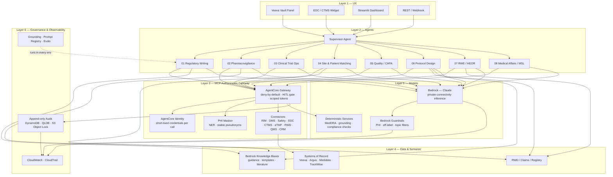

# Suite Architecture Reference
### HCLS AI Agent Suite — Six-Layer Architecture and AWS Service Mapping

---

## Overview

The suite is organized into six horizontal layers, each with a distinct responsibility. Concerns do not bleed between layers: a change to the observability layer does not affect agent logic; a change to the model layer does not affect authorization. This separation is what makes the platform extensible to additional agents and auditable by a compliance function.

```
┌─────────────────────────────────────────────────────────────────────────┐
│  LAYER 6 — GOVERNANCE & OBSERVABILITY                                   │
│  Grounding · Prompt registry · Eval harness · Audit · Alerting          │
├─────────────────────────────────────────────────────────────────────────┤
│  LAYER 5 — MODELS & DETERMINISTIC SERVICES                              │
│  Bedrock (Claude) · Guardrails · MedDRA/WHO Drug coders · NER masker    │
├─────────────────────────────────────────────────────────────────────────┤
│  LAYER 4 — DATA & SEMANTIC LAYER                                        │
│  Knowledge bases · Vector search · Structured study data · RWD          │
├─────────────────────────────────────────────────────────────────────────┤
│  LAYER 3 — TOOL & INTEGRATION LAYER (MCP AUTHORIZATION GATEWAY)         │
│  AgentCore Gateway · AgentCore Identity · Connectors · PHI Masker       │
├─────────────────────────────────────────────────────────────────────────┤
│  LAYER 2 — SUPERVISOR & SPECIALIST AGENTS                               │
│  LangGraph orchestration · Specialist agent graphs · HITL gates          │
├─────────────────────────────────────────────────────────────────────────┤
│  LAYER 1 — UX IN EXISTING APPLICATIONS                                  │
│  Veeva Vault panels · EDC/CTMS widgets · Streamlit · API / webhook       │
└─────────────────────────────────────────────────────────────────────────┘
```

---

## Layer 1 — UX in Existing Applications

Agents surface inside the applications that regulated professionals already use — not as standalone AI portals that require a context switch. Integration patterns:

- **Veeva Vault panel** (Regulatory, Safety, Quality): an embedded sidebar that calls the agent API for the current document, case, or record in focus
- **EDC/CTMS widget** (Clinical): an in-app query assistant and TMF completeness view inside Medidata or similar
- **Streamlit dashboard** (cross-agent): the reference UI in `01-regulatory-writing-agent/app.py`; suitable for internal demonstration and early pilots before deep system integration
- **REST/webhook API**: all agent graphs expose a stateless invocation endpoint compatible with AgentCore Runtime's `/invocations` contract; any downstream application can call them

The UX layer is intentionally thin. It captures the user's identity (forwarded as IdP claims), passes the task context, and renders the agent's structured output. Authorization happens at Layer 3, not the UI.

---

## Layer 2 — Supervisor and Specialist Agents

Each of the nine specialist agents is a **LangGraph StateGraph** — a directed, stateful workflow with deterministic routing and a framework-enforced interrupt for human approval.

### Specialist Agent Pattern

```
Intake → [Retrieval nodes] → Draft / Analyze → [Compliance gate] → Routing → HITL Gate → Finalize
```

The routing node decides whether the output is clean (routes to HITL gate), requires one bounded revision (loops back to draft), or is prohibited (escalates). Every path through the graph leads to a human decision; there is no path from intake to finalize that bypasses the HITL gate.

### Supervisor Agent (Multi-agent workflows)

For workflows that span multiple agents (e.g., a submission readiness check that touches both Regulatory Writing and Clinical Trial Ops), a lightweight supervisor agent routes user intent to the appropriate specialist, forwards the original user claims, and aggregates results. The supervisor does not hold tool grants; it can only invoke specialists, not systems of record directly.

### Human-in-the-Loop (HITL) Gate

Implemented via LangGraph `interrupt_before` on the `finalize` node. The graph is suspended, the draft and compliance report are surfaced to a named reviewer, and execution resumes only when a verified approval record is written to the HITL queue table. The gateway enforces that the approval record contains a valid reviewer identity before minting the write token for the downstream system.

---

## Layer 3 — Tool and Integration Layer (MCP Authorization Gateway)

The governed front door. Every agent tool call — read or write — passes through this layer. No agent has a direct network path to a system of record.

### Components

- **AgentCore Gateway** (production: `infra/cloudformation/agentcore-gateway.yaml`; reference logic: `platform_core/hcls_agent_platform/mcp_gateway/`): registers tool targets, runs the authorization decision, enforces human-approval gate for high-risk tools
- **AgentCore Identity** (production: AgentCore Identity service; reference: `tokens.py`): mints short-lived, per-call credentials scoped to exactly the requested tool; no standing service accounts
- **Connector framework** (`platform_core/hcls_agent_platform/connectors/`): per-system adapters (RIM, DMS, Safety, EDC, CTMS, eTMF, RWD, QMS, CRM); implements the `invoke(method, args)` interface; fixture mode in demo, live in production
- **PHI masker** (`platform_core/hcls_agent_platform/phi_masker/`): NER-based entity recognition runs before every inbound tool result enters a prompt or audit record; stable pseudonyms allow cross-call tracing without PHI exposure

---

## Layer 4 — Data and Semantic Layer

The retrieval substrate that grounds agent outputs:

- **Amazon Bedrock Knowledge Bases** (vector store backed by OpenSearch Serverless or Aurora pgvector): indexed regulatory guidance documents, submission templates, historical CSR sections, CAPA precedents, HCP scientific literature
- **Structured study data**: EDC subject data, CTMS enrollment metrics, eTMF completeness tables — retrieved via gateway-authorized connectors, not direct DB access
- **Real-world data (RWD)**: claims, registry, and EHR cohort data; accessed via the `rwd.run_cohort_query` connector; de-identification is a prerequisite before the query result enters an agent prompt
- **Coding dictionaries** (MedDRA, WHO Drug): validated against live dictionary versions; the PV agent's MedDRA coder connector checks confidence and flags low-confidence codes for reviewer attention

---

## Layer 5 — Models and Deterministic Services

- **Amazon Bedrock (Claude models)**: primary inference endpoint; runs in-account; Bedrock API never carries PHI outside the customer's VPC after PHI masking
- **Bedrock Guardrails**: configured at the stack level (`infra/cloudformation/security.yaml`); enforces PHI denial policies, off-label and promotional content blocking, and topic filters appropriate to the deployment context; runs on every LLM call automatically
- **Deterministic services**: not everything needs an LLM. MedDRA coding, grounding verification, structural completeness checks, and prohibited-language detection are implemented as deterministic Python functions — they are fast, testable, and produce consistent outputs that can be included in validation evidence

---

## Layer 6 — Governance and Observability

This layer runs continuously, in every environment:

- **Grounding verification** (`governance/grounding.py`): every claim in a regulated draft is traced to a source document in the grounding corpus; ungrounded claims fail fast before the draft reaches a human reviewer
- **Prompt version registry** (`governance/prompt_registry.py`, `governance/prompt_manifest.json`): all prompts are hash-pinned; CI fails if a prompt has changed without a version bump — this is the model-risk change-control mechanism
- **Eval harness** (`governance/evals/`): structural completeness regression over reviewed golden artifacts (CIOMS/E2B ICSR format, benefit-risk section anatomy, CAPA report structure); runs in CI without API keys; golden artifacts represent the known-good outputs that a prompt or model change must not regress
- **HITL gate tests** (`governance/tests/test_hitl_gates.py`): asserts that the framework-enforced human approval cannot be bypassed by any code path — the test fails if the interrupt is missing
- **Red team** (`governance/redteam/`): prompt injection, PHI exfiltration, and authorization bypass test scenarios run against the gateway policy
- **Fairness** (`governance/fairness/`): demographic representativeness checks for proposed cohorts (FDA Diversity Action Plan posture)
- **CloudWatch**: operational metrics (invocation counts, latency, error rates, HITL queue depth, approval latency) with alarms for anomalies
- **CloudTrail**: API-level audit of all AWS service calls; feeds the same append-only audit trail as gateway events for a unified compliance record

---

## Mermaid Diagram — Full Suite Reference Architecture



---

## AWS Service Mapping

| Architecture role | AWS service | Notes |
|---|---|---|
| Agent runtime (container) | **Amazon Bedrock AgentCore Runtime** | ARM64 container; `/invocations` + `/ping`; autoscaling |
| Agent runtime (native/serverless) | **AWS Step Functions + Lambda** | `waitForTaskToken` HITL gate; deterministic core |
| Agent orchestration | **AWS Step Functions Express** | Parallel fan-out for multi-agent; audit in CloudWatch |
| MCP authorization gateway | **Amazon Bedrock AgentCore Gateway** | Target registration; authorizer; deny-by-default |
| Federated identity + scoped tokens | **Amazon Bedrock AgentCore Identity + Amazon Cognito** | IdP federation; short-lived credentials; role mapping |
| LLM inference | **Amazon Bedrock (Claude models)** | Reached via PrivateLink; no PHI egress to external AI APIs; model access policies |
| Content safety + PHI controls | **Amazon Bedrock Guardrails** | PHI denial; off-label topic filter; grounding check |
| Knowledge base / vector search | **Amazon Bedrock Knowledge Bases** | OpenSearch Serverless or Aurora pgvector backing |
| Compute (fallback / batch) | **Amazon ECS Fargate** | Fallback if AgentCore Runtime not available in region |
| Append-only audit trail | **Amazon DynamoDB** (append-only policy) | `deny:dynamodb:UpdateItem` + `deny:dynamodb:DeleteItem` on audit partition; PITR enabled |
| Highest-assurance audit (Part 11) | **Amazon QLDB** | Cryptographic verification for e-signature chains |
| WORM document store | **Amazon S3 + Object Lock** (COMPLIANCE mode) | Submitted documents; finalized audit snapshots |
| Encryption at rest + key management | **AWS KMS** (customer-managed key) | Separate key per environment; key policy restricts to agent role |
| IdP federation | **Amazon Cognito** (User Pools + Identity Pools) | SAML 2.0 / OIDC; maps IdP groups to `custom:hcls_role` |
| Operational observability | **Amazon CloudWatch** (metrics, logs, alarms) | HITL queue depth; approval latency; error rate alarms |
| API-level audit | **AWS CloudTrail** | All API calls; feeds unified compliance record |
| Network isolation | **Amazon VPC** (private subnets + NAT + security groups) | No public inbound; Bedrock via VPC endpoint; all inter-service traffic stays in VPC |
| IaC — primary | **AWS CloudFormation** | `infra/cloudformation/quickstart.yaml` master stack |
| IaC — parity | **Terraform** | `infra/terraform/`; identical resource topology |
